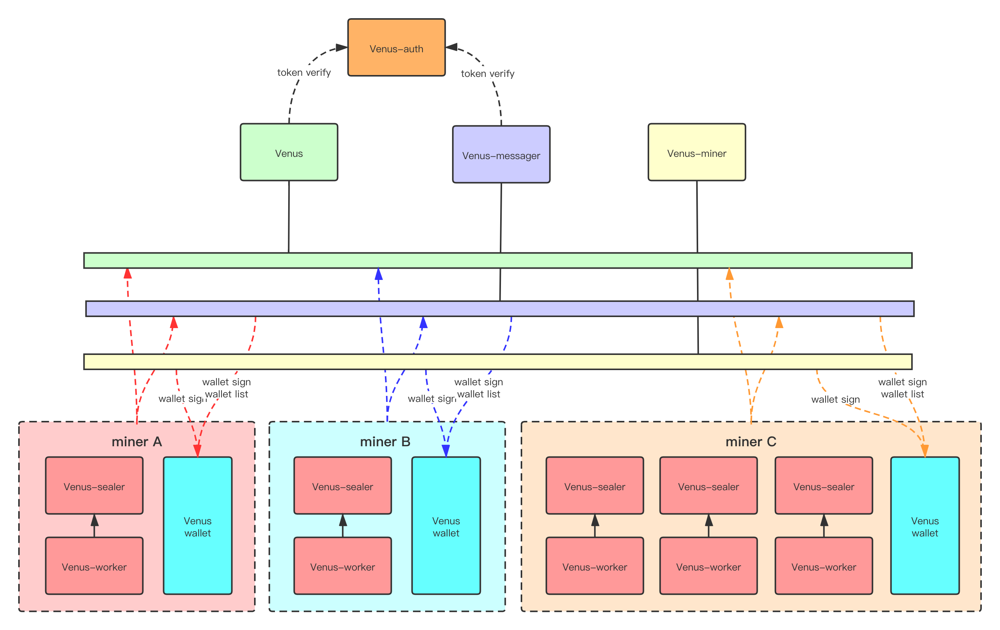
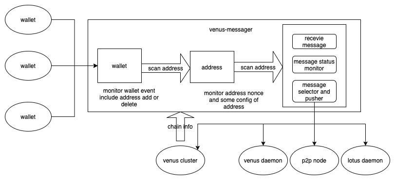

## Preface

Multiple interoperable software implementations are required on the same blockchain. Each implementation has its own set of security issues, but they are not all the same . Therefore, launching cryptocurrency networks with multiple implementations can reduce the catastrophic errors. Venus is one of the implementations of Filecoin network.

Venus (Capital V) refers to one of the general implementations of Filecoin, while venus (v in lowercase) refers to one of the components of Venus. Venus is committed to helping small and medium-sized miners join in the Filecoin ecosystem network with a lower barrier.

Now Venus has realized the support for distributed mine pool of Filecoin through components like venus, venus-sealer, venus-miner, venus-wallet, venus-messager and venus-auth. In the future, Venus will continue its evolvement and jointly promote the open source development of Filecoin ecosystem.

## Why are we doing this

In June 2020, Protocol Lab launched an RFP to continue the maintenance of go-filecoin by a new community, and IPFSForce applied for and successfully got the project. In October, We renamed go-filecoin as Venus, and continued the maintenance of Venus Project.

Before IPFSForce’s application, maintenance is seriously lacking in Venus project. . In terms of protocols and components, vm,mpool, chain, rpc are all available, but all of them have different problems. It takes us more than three months to gradually fix protocol layer, code layer, and problematic fuctions, making Venus complete the interoperability with Lotus, so that the nodes using Venus can run smoothly on the network. And then we let Venus support calibration, Nerpa and 2K networks.

After completing the above work, we start to set the direction of Venus development.

We plan to let Venus support the development of mining pool. At the start, we decide to realize the expansion from a single miner. It is technically feasible, but the biggest problem is caused by the mechanism of Filecoin proofs. Miners in the Filecoin network have to submit the PoSt periodically, and in order to generate the proof, they need to read the data of a whole partition. If all sectors are distributed in different places, to read the data through the public network will be too time-consuming.

After that, through several times of re-design and modification, we finally realize the current plan, as a distributed mining pool. Distributed mine pool will not completely in charge with any single miner, but managed by multiple miners, which is more like a miner union.

The external features of Venus distributed mining pool are similar to other pools. Miners can store their resources in distributed geographic nodes. As long as there is a place accessible to the network, the miner can create a node accessible to Venus mine pool; The probability of earning the block reward is proportional to the amount of storage the miner contributes to the Filecoin network, and the final result of separate calculation and overall calculation should be the same: ***n1/p+ n2/p+n3/p......= (n1+n2+n3+.....)/p***, which provides a theoretical basis on the algorithm.

On the storage and retrieval of real data, miners can access the network through the venus unified entrance or by themselves. In the design and with the permission from miners, venus will select the appropriate node to store data according to specific requirements, so that the data is closer to the real scenario.

1. ***Data storage***: component sharing is supported, and the storage will be gradually migrated to MySQL to ensure the metadata security of Venus through some highly available solutions.
   
2. ***Shared components***: support high availability, ensure the quality of service, reduce the time cost and maintenance cost of miners, which make it easier for miners to join the mining pool. Nowadays, mining is a  high-tech activity, but to realize Filecoin's goal to get the utmost out of storage resources, it is inevitable to lower the threshold to attract more participants.
   
3. ***Combine the right for more block rewards***: miners can integrate resources together and help each other pack messages, so as to avoid the situation of small miners that no one can pack messages.
   
4. ***Improve the TPS of Filecoin network***: if there are multiple blocks at the same height, venus-miner can ensure that the messages in each block are different, as the avoidance of highly-repeated messages when blocks are separated.
   
5. ***Improve the stability of messages***: messages in mining activities can be separated from nodes and managed by venus-messager, which can track the latest state of the chain to set a relatively reasonable estimated gas parameter, and also supports users to set a message parameter themselves.

6. ***Improve the speed of data access***: the current Filecoin network is more like a pool which is merely for data storage, but as a complete data service, it also needs data retrieval to realize its real value. With sufficient miner users, Venus has more chances to promote the real data application. For example, for data distribution, Venus can distribute the data to some miners' nodes nearest to the customers, which can improve the access speed;  some public data can distribute these data to more nodes as much as possible to ensure that access at any location is effective, which can greatly improve the performance of IPFS network and further realize the goal of IPFS, as one of Web3.0 solutions.

## How Venus works

### Architecture

Venus architecture includes venus, venus-miner, venus-sealer, venus-messager, venus-wallet, venus-auth, and venus-market which is still in design. In the classic architecture, venus, venus-miner, venus-auth, venus-messager and venus-market are public components, and venus-sealer and venus-wallet are local components.

Public components can be established by service providers or by multiple miners, and miners only need to run venus-sealer, venus-worker and venus-wallet locally. In fact, all components of Venus are protocol oriented. If miners have sufficient technology, they can also deploy all or part of the public components locally, so the deployment can be more flexible.

The following figure is a typical application scenario in our design.

The following contents show the relationship between components, which are similar in function, but with more powerful expanded functions in details and uses.

*  venus-auth --> token authentication service extend lotus jwt
*  venus-miner --> lotus-miner block produce part
*  venus-sealer --> lotus-miner sealer scheduler part/wd
*  venus-worker --> lotus-worker
*  venus daemon --> lotus daemon
*  venus-wallet -> lotus wallet part
*  venus-messager --> lotus mpool

### venus-auth

venus-auth is a component used for authorization. In a typical deployment environment, venus-auth is used to provide authorization services to venus, venus-miner and venus-messager. Local nodes need to be authorized to have access to the shared components. Based on the authorization, venus-auth will expand its functions, such as security control, including access restriction and blacklist.

### venus

venus is similar to lotus-daemon, which is used to realize all nodes. venus is connected to the Filecoin blockchain network to provide data support for Venus. venus can be used as an ordinary node. It has all the necessary functions of blockchain nodes, such as chain, mpool and wallet. The APIs of venus are almost compatible with those of lotus (you can mention the issue of incompatible APIs). On venus, you can create private keys, query assets, transfer funds, etc. In a typical deployment environment, venus only provides data query service on the basic chain without private key restoration. The block data needed by slashfilter is stored in the database, and the node itself is stateless. In this case, venus node can realize its high availability  through nginx reverse proxy.

There are some differences between nodes of venus and lotus:

1. External signature is supported in the API of creating block (pr will be proposed to lotus later).
2. The API of message selection supports the selection of multiple batches of messages at the same time, which is used to select messages when multiple miners get the block rewards.
3. Support the centralized authorization access to venus-auth.
   
Therefore, if you are interested in the mixed deployment of venus / lotus, you need to use our Venus project which is compatible to Venus or pick your own CCS.

### venus-miner

The function of venus-miner is to combine the rights of block rewards. The program can configure the location of multiple miners and their sealers and wallets, and generate blocks for these miners at the same time. venus-miner has the following features:

1. 1.Separate data: because the process of generating blocks needs to access data, and miner's sealer may be heterogeneous, but now most miners will use their own codes, so there is a problem about how to access these data to realize joint mining. By venus-miner’s independence on the storage organization mode and completing the proofs by miners, no matter how the miner's sealer organizes the storage, as long as the Computeproof API is implemented, venus-miner can generate the proof through it.
2. Separate private key: when calculating random numbers and signature blocks, all operations about private key are accessed through remote wallet, which can improve the security of mining activities.
3. Improve miners' income and TPS: when the miner who uses venus-miner rto get multiple (> 1) rights of block rewards in a period, venus-miner will try to select different messages from the message pool for packaging, which can somehow improve the speed of these messages on the chain, and make the block get more probable premium.

### venus-messager

The goal of venus-messager is to help messages on chain more efficiently, and to flexibly control the timing of messages on chain to reduce gas consumption and control the data traffic, etc. It includes remote wallet management, address management and message management.

1. Wallet management: venus-messager connects multiple wallets and scans these addresses into the list.
2. Address management: the major purpose is to manage the nonce value to ensure that the value can be assigned in the correct order.
3. Message management: it is divided into three parts, namely "message receiving and saving", "message selection and pushing" and "tracking the status of message on the chain".

In terms of functions:

1. Support remote wallet: one messager supports multiple wallets to manage their message separately.
2. Support  local storage of SQLite and remote storage of MySQL for more secure and stable storage.
3. Dynamic Fill: gas related parameters and nonce are to be filled out when sending a message on chain according to gas and push policy, to make sure the gas-estimation and other setting are valid.
4.  Maintain message status, including whether the message is chained and replaced and save the results of the execution.
5.  Multi-point message delivery (directly to the blockchain network with libp2p, push to the node by Mpool API), to make sure that messages are propagated over the network.
6.  Flexible config includes gas estimate, msg push strategy, etc.

### venus-wallet

venus-wallet is a remote wallet, which can support both Lotus and Venus in terms of protocols. In a typical deployment environment, this component is deployed locally by miners, and the security of assets is guaranteed by certain policy configuration. venus-wallet has the following features:

1. Private key management module: currently it supports the private key management of asymmetric algorithms BLS and SECP, and it can generate random private key, and uses aes128 to encrypt and store the private key symmetrically whilst supports the private key to sign the data.
2. Signature verification: each signature type has its verification policy, which ensures that the signer won't do deceits  the wallet through  non-credible signature type.
3. Signature tactics module: for the Lotus and Venus implementation of Filecoin, the module is created to manage  10 existing data structures and more than 60 signature types in message data structure, and configure various combination methods on demand to bind private key signature rules, and then integrate several different private key signature rules and authorize them to external components for further usage.

### venus-sealer + venus-worker

venus-sealer continues the basic features of the mining part of lotus. We separate the mining related code from the sealer to form venus-sealer. The differences are:

1. Access to the messager system, and all messages are managed in the messager.
2. Storage is separated from the badger, and SQLite is used to save metadata, sector state, machine information, scheduling and related results. In the future, MySQL storage will be further supported to ensure data security.

## Some ideas for the future

The following plans mainly focus on:
1. Follow up the latest Filecoin network.
2. Start the venus-market project and improve the entire venus system.
3. Optimize venus-sealer scheduling mode and storage (in planning).
4. Improve the availability of components, continuously test components, fix some potential problems, ensure the stability and security of component services, and simplify the deployment mode.
5.  Optimize the log system to facilitate problem query and tracking.