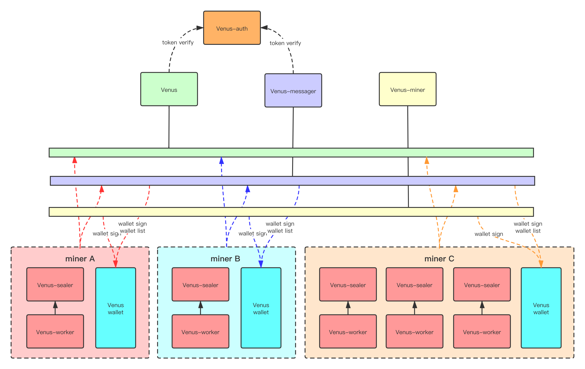

# Introduction of cluster components of Venus
Venus is one of the implementation schemes of filecoin. 
The system components include: venus, venus-auth, venus-miner, venus-wallet, venus-messager and venus-sealer.
Conceptually, venus, venus-auth, venus-miner, venus-wallet and venus-messager can be shared (that is, the program can be used by multiple miners to make full use of hardware and software resources while ensuring efficiency), while venus-sealer, venus-worker and venus-wallet are mainly used to accumulate power.


# Deploying Venus cluster (based on Nerpa)


program | server | type | purpose
--- | --- | --- | ---
Venus-auth     |   \<IP1\> | Shared| Venus auth is used for unified authorization. When a miner's own running component accesses a shared component, it needs to use this service to register the generated token.
Venus-wallet   |   \<IP2\> | Shared| Manage your wallet, Message signature
Venus          |   \<IP3\> | Shared| chain Sync
Venus-messager |   \<IP4\> | Shared| Manage the message in the cluster, ensure the message on the chain, control the message flow, and try again. It can dock multiple wallets and manage messages for these wallets.
Venus-miner    |   \<IP5\> | Shared| Package the block message; Multiple miners can be configured; It can calculate the miner's minning situation by itself, and obtain data proof through remote access to venus-sealer.
Venus-sealer   |   \<IP6\> | Unshared| Sealing data

Tips:
 - All the following `<>` are parameters that need to be replaced, according to their own actual situation
 - Please use ‘git checkout’ to select the specific version
 - Environmental dependence:
     - golang ^1.15
        - go env -w GOPROXY=https://goproxy.io,direct
        - go env -w GO111MODULE=on
     - git

## 1. Venus-auth Install
### Compile and start

```shell script
$ git clone https://github.com/filecoin-project/venus-auth.git

$ cd venus-auth

$ make 

$ nohup ./venus-auth > auth.log 2>&1 &

```
- The default configuration file directory of Venus auth service is: ~/.venus-auth/config.toml
- The default storage scheme is the badger embedded kv database, which also supports MySQL storage. You need to modify the configuration file to start.
- The default of log storage is console printing, and it also supports influxdb storage.

#### MySQL storage startup (optional)
Tips: MySQL supports official versions above 5.7（If the default settings of MySQL on the cloud platform are different, please modify the configuration in combination with the cloud platform, otherwise , may appear “ Specified key was too long; max key length is 767 bytes ” ）


- Initialize database and table
```mysql
CREATE DATABASE `venus_auth` /*!40100 DEFAULT CHARACTER SET utf8 */;
USE `venus_auth`;

CREATE TABLE `token` (
     `name` varchar(50) NOT NULL,
     `token` varchar(512) NOT NULL,
     `createTime` datetime NOT NULL,
     `perm` varchar(50) NOT NULL,
     `extra` varchar(255) DEFAULT NULL,
     UNIQUE KEY `token_token_IDX` (`token`) USING HASH
) ENGINE=InnoDB
  DEFAULT CHARSET = utf8
  COLLATE = utf8_general_ci;

```

- Modifying DB settings in venus-auth config

```shell script
$ vim ~/.venus-auth/config.toml

# Data source configuration item
[db]
# support: badger (default), mysql 
# the mysql DDL is in the script package 
type = "mysql" 
# The following parameters apply to MySQL
DSN = "root:111111@(127.0.0.1:3306)/venus_auth?parseTime=true&loc=Local&charset=utf8mb4&collation=utf8mb4_unicode_ci&readTimeout=10s&writeTimeout=10s"
# conns 1500 concurrent
maxOpenConns = 64
maxIdleConns = 128
maxLifeTime = "120s"
maxIdleTime = "30s"

```
- start-up
```shell script
$ nohup ./venus-auth > auth.log 2>&1 &
```

### Register and generate the token of each component

```shell script
$ ./venus-auth genToken --perm admin miner
<auth token miner>

$ ./venus-auth genToken --perm admin messager
<auth token messager>

$ ./venus-auth genToken --perm admin sealer
<auth token sealer>
```
- `<auth token ?>` The format is unified as JWT token
- These tokens will be used by various programs to verify the cluster access components
- `--perm`--Perm is the access restriction of PRC2.0 interface
- miner，messager，sealer，It is recommended to mark it as the program name. If there are multiple same programs to join the cluster, you can use "program name + tag".


## 2. Venus install
### Install the compilation environment
```shell script
sudo yum install -y https://dl.fedoraproject.org/pub/epel/epel-release-latest-7.noarch.rpm; sudo yum install -y git gcc bzr jq pkgconfig clang llvm mesa-libGL-devel opencl-headers ocl-icd ocl-icd-devel hwloc-devel
```
### Compile and start
```shell script
$ git clone https://github.com/filecoin-project/venus.git

$ cd venus

$ make deps

$ make

# Start Venus daemon to set the address of the network and venus-auth
# After successful startup, tail - F venus.log can see the log of data synchronization
# It's going to take a while here
$ nohup ./venus daemon --network nerpa \
--authURL http://<IP1>:8989 \
> venus.log 2>&1 & 

```
- `--authURL` is set to listen to the HTTP address of venus-auth

### Modify IPv4 listening address
At present, after the program starts, the default listening address is `127.0.0.1:3453`. For cross server clusters, you need to modify the listening policy. You can query the process through `lsof -i:3453` , kill the process, modify the IPv4 policy, and then restart.

```shell script
vim ~/.venus/config.json

# Do the following operations to monitor all local IPv4 addresses:
# replace api.apiAddress from 
# "/ip4/127.0.0.1/tcp/3453"  to  "/ip4/0.0.0.0/tcp/3453"

# Restart the service after modification:
$ nohup ./venus daemon --network nerpa \
--authURL http://<IP1>:8989 \
> venus.log 2>&1 & <absolute path>

```


## 3. Venus-wallet install
### Compile and start
```shell script
$ git clone https://github.com/filecoin-project/venus-wallet.git

$ cd venus-wallet 

# Compile
$ make

# start
$ nohup ./venus-wallet run  --network test> wallet.log 2>&1 &
```

### Set password and create Wallet
> Here, two BLS wallets are created for the subsequent venus-sealer initialization
```shell script
# Set lock and unlock password
$ ./venus-wallet setpwd
Password:******
Enter Password again:******

# Generate BLS address
$ ./venus-wallet new bls
<bls address 1>
$ ./venus-wallet new bls
<bls address 2>
```
- `<bls address 1>` is an 86 bit address
#### Attention
The newly generated `<bls address 1>` `<bls address 2>` needs to be pre charged with balance in https://faucet.nerpa.interplanetary.dev/funds.html before actor can be generated on the chain.

```shell script
$ ./venus-wallet auth api-info --perm admin
<wallet jwt token>
```
## 4. Venus-messager install
### Compile and start
```shell script
$ git clone https://github.com/filecoin-project/venus-messager.git

$ cd venus-messager

$ make deps

$ make 

# Start the venus-messager process
$ nohup ./venus-messager run \
--auth-url=http://<IP1>:8989 \
--node-url /ip4/<IP3>/tcp/3453 \
--node-token <auth token messager> \
--db-type mysql \
--mysql-dsn "root:111111@tcp(127.0.0.1:3306)/cali_venus?parseTime=true&loc=Local&readTimeout=10s&writeTimeout=10s" \
> msg.log 2>&1 &
```
- `--auth-url` is to set venus-auth listening address
- `--node-url` is to set venus listening address
- `--node-token` JWT token registered in venus-auth represents its own node and is used for authentication when communicating with venus


### Add wallet link (multiple wallet links can be added)
> This side will periodically monitor the change of the accessible address of the venus-wallet \
Delay dynamic tracking depends on the `list` interface at `venus-wallet`
```shell script
$ ./venus-messager wallet add \
--name testminer --url /ip4/<IP2>/tcp/5678/http \
--token <wallet jwt token> 

# Query wallet list
$ ./venus-messager wallet list
```
- `--name` adds wallet link name to venus-messager
- `--url` is to set the venus-wallet listening address
- `--token` Set the JWT token of interface authorization obtained in venus-wallet, and view the token at `<wallet jwt token>` in Venus wallet install

## 5. Venus-sealer install

### sealer has two kinds of JWT token concepts
1. The local JWT token `<sealer jwt token>`  is used for other services to access sealer
2. The JWT token `<auth token sealer>` registered by venus-auth is used for sealer to access messager
 
### Compile and start (sealer single program can only bind one miner)
```shell script
$ git clone https://github.com/filecoin-project/venus-sealer.git

$ cd venus-sealer

$ make deps

$ make
```
#### Initialize new miner (1 out of 2)
```shell script
$ nohup ./venus-sealer init \
--worker <bls address 1> \
--owner <bls address 2>  \
--sector-size 512M \
--network nerpa \
--node-url /ip4/<IP3>/tcp/3453 \
--node-token <auth token sealer> \
--messager-url http://<IP4>:39812/rpc/v0 \
--no-local-storage \
--messager-token <auth token sealer> \
--wallet-name testminer \
> sealer.log 2>&1 &
```

#### Initialize the existing miner (1 out of 2)
> You do not need to specify `--sector-size`
```shell script
$ ./venus-sealer init \
--actor <t0 addr>  \
--network nerpa \
--node-url /ip4/<IP3>/tcp/3453 \
--node-token <auth token sealer> \
--messager-url http://<IP4>:39812/rpc/v0 \
--no-local-storage \
--messager-token <auth token sealer> \
--wallet-name testminer 

# Check the log, wait for the message to be chained, and register the actor address
2021-04-25T18:41:31.925+0800	INFO	main	venus-sealer/init.go:182	Checking if repo exists
2021-04-25T18:41:31.926+0800	INFO	main	venus-sealer/init.go:217	Checking full node version
2021-04-25T18:41:31.927+0800	INFO	main	venus-sealer/init.go:233	Initializing repo
2021-04-25T18:41:31.928+0800	INFO	main	venus-sealer/init.go:309	Initializing libp2p identity
2021-04-25T18:41:32.082+0800	INFO	main	venus-sealer/init.go:485	Pushed CreateMiner message: aaf489f9-af4b-4e4b-9084-018d43f05b7e
2021-04-25T18:41:32.082+0800	INFO	main	venus-sealer/init.go:486	Waiting for confirmation
2021-04-25T18:46:32.088+0800	INFO	main	venus-sealer/init.go:502	New miners address is: t01640 (t2cxzf7xvrqo3froqn2xgdqjdbydhkcrgakj7j3ma)
2021-04-25T18:46:32.088+0800	INFO	main	venus-sealer/init.go:381	Created new miner: t01640
2021-04-25T18:46:32.089+0800	INFO	main	venus-sealer/init.go:302	Sealer successfully created, you can now start it with 'venus-sealer run'
```

- `--wallet-name testminer` is the wallet connection added in the venus-messager, so in the wallet, the worker and owner specified here must exist in the venus-wallet
- `<bls address 1>`  `<bls address 2>` is the BLS wallet address created in venus-wallet. Note that balance is required for both wallet addresses
- `<auth token sealer>`XXXX is the JWT token registered in venus-auth
- `<absolute path>` is the absolute path

#### Start sealer and perform sector encapsulation
```shell script
$ nohup ./venus-sealer run >> sealer.log 2>&1 &


# Specify storage directory（optional）
# Because --no-local-storage is specified
# So you need to specify the sealer storage directory
$ ./venus-sealer storage attach --init --store --seal <absolute path>

# Sector encapsulation command
# You can do timing tasks through crontab, or you can write your own policy scripts
$ ./venus-sealer sectors pledge 

# Query section list
$ ./venus-sealer sectors list

# Query actor address
# Here is <t0 addr>
$ ./venus-sealer info

Chain: [sync ok] [basefee 100 aFIL]
Sealer: <t0 addr> (512 MiB sectors)
Power: 0  / 15 Ti (0.0000%)
	Raw: 0 B / 1.5 TiB (0.0000%)
	Committed: 3 GiB
	Proving: 0 B
Below minimum power threshold, no blocks will be won
Sealer Balance:    383.869 FIL
      PreCommit:  0
      Pledge:     93.75 mFIL
      Vesting:    0
      Available:  383.775 FIL
Market Balance:   0
       Locked:    0
       Available: 0
Worker Balance:   1000 FIL
Total Spendable:  1383.775 FIL
```


## 6. Venus-miner install

### Compile and start
```shell script
$ git clone https://github.com/filecoin-project/venus-miner.git

$ cd venus-miner

$ make nerpanet

# Initialize environment configuration
$ ./venus-miner init --api /ip4/<IP3>/tcp/3453 --token <auth token miner>

# Startup miner
$ nohup ./venus-miner run >>miner.log 2>& 1 &


$ ./venus-miner address add \
--addr <t0 addr> \
--sealer-listen-api /ip4/<IP6>/tcp/2345/http \
--sealer-token <sealer jwt token> \
--wallet-listen-api /ip4/<IP2>/tcp/5678/http \
--wallet-token <wallet jwt token> 

# print
add miner:  {<t0 addr> {...}}


# Query miner status
$ ./venus-miner address state 
# print
[
	{
		"Addr": "<t0 addr>",
		"IsMining": true,
		"Err": ""
	}
]

# If IsMining is false
# This command needs to be executed
$ ./venus-miner address start <t0 addr>

# Because miner supports multiple miners
# You can view all the associated miners with the following command
# The start and stop of miners can be set by themselves
$ ./venus-miner address list
```
- `<t0 addr>` can be viewed in the venus-sealer install section
- `<sealer jwt token>` is the JWT token of the venus-sealer node. After switching to the corresponding server, Execute `cat ~/.venussealer/token` to get it
- `<wallet jwt token>` is to set the JWT token of interface authorization obtained in venus-wallet. Check the `<wallet jwt token>` in venus-wallet install to find out how to obtain the token


## Related issues

1. The Go mod has the following problems
```shell script
SECURITY ERROR
This download does NOT match an earlier download recorded in go.sum.
The bits may have been replaced on the origin server, or an attacker may
have intercepted the download attempt.


# solution
go clean -modcache
go mod tidy
```
