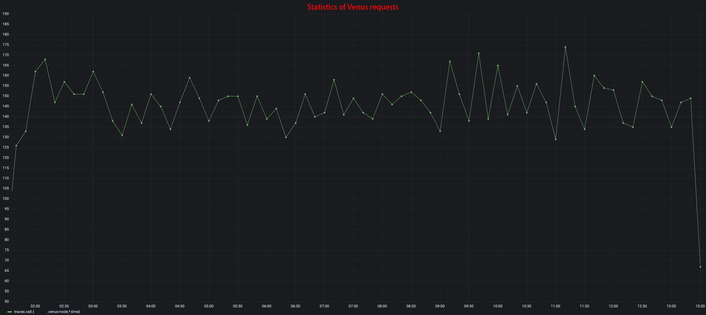
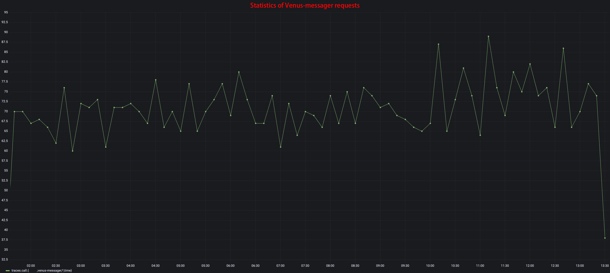
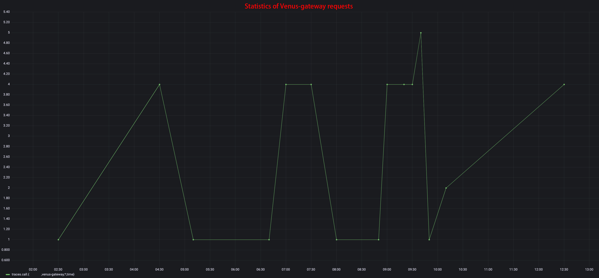
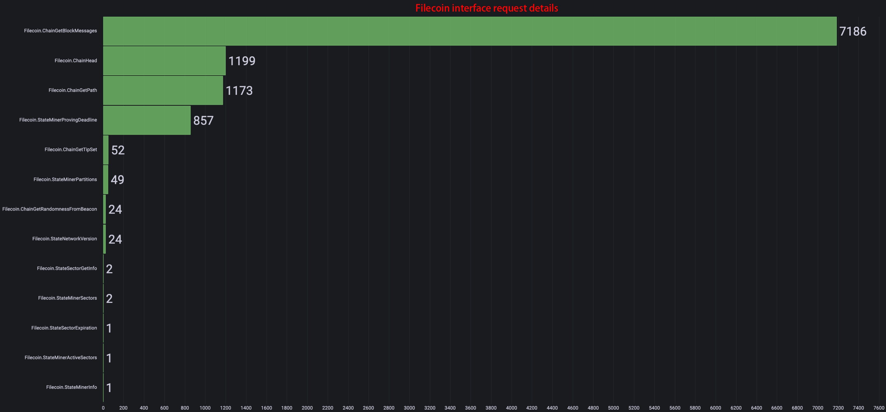

### Local modules

The independent components of the venus system are venus-sealer/venus-cluster and venus-wallet. venus-sealer is 1st generation of PoRep and PoSt component which will no longer be maintained in the second phase of the incubation center. **venus-cluster** is latest generation of Venus' PoRep and PoSt component. Compared with venus-sealer, it has a great improvement in task scheduling and system resources management. **venus-cluster** will be actively maintained and is now the recommended component for PoRep and PoSt.


#### venus-wallet

Check if wallet process is running.

```bash
INFO	main	cmd/rpc.go:73	start rpc server at [/ip4/0.0.0.0/tcp/5678/http] ...
ERROR	wallet_event	wallet_event/listenevent.go:236	WalletSign error password not set	{"api hub": "/dns/gateway.filincubator.com/tcp/83/wss"}
WARN	wallet_event	wallet_event/listenevent.go:164	listenWalletRequestOnce quit	{"api hub": "/dns/gateway.filincubator.com/tcp/83/wss"}
INFO	wallet_event	wallet_event/listenevent.go:173	restarting listenWalletRequestOnce	{"api hub": "/dns/gateway.filincubator.com/tcp/83/wss"}
INFO	wallet_event	wallet_event/listenevent.go:184		{"rand sign byte": "TCzGneQnvI2N6LqBVf0AHwaEr+NueDnk1aCSo+1G3SA="}
```
When encountered `WalletSign error password not set`, run `venus-wallet setpwd`.

```bash
$ ./venus-wallet setpwd
Password:********
Enter Password again:********
Password set successfully
```

Import and export of private keys.

```bash
$ ./venus-wallet import
Enter private key: 7b2254797065223a22626c73222c22626c73222c22507269766174654b6579223a227135
imported key t3w42mmqem7wfhmqf2ovrssz6qe24ymkfdsafdnkjnjknkjndafsadafn25ztb6e7a successfully!

$ ./venus-wallet export t3w42mmqem7wfhmqf2ovrssz6qe24ymkfdsafdnkjnjknkjndafsadafn25ztb6e7a
Password:********
7b2254797065223a22626c73222c22626c73222c22507269766174654b6579223a227135
```

#### venus-sealer

Check proving info.

```bash
$ ./venus-sealer proving info
```

Check deadlin 0 info.

```bash
$ ./venus-sealer proving deadline 0
```

Check all deadlines.

```bash
$ ./venus-sealer proving deadlines
```

Check if sector file of deadline 0 exists.

```bash
$ ./venus-sealer proving check 0 
```

Check list of faulty sectors.

```bash
$ ./venus-sealer proving faults
```

Check faulty sectors in deadline 7.

```bash
$ ./venus-sealer proving check --only-bad 7
```

#### venus-cluster

Please refer to documentations [here](https://github.com/ipfs-force-community/venus-cluster/tree/main/docs/zh).

### Chain services monitoring

#### Module API usage stats

- All


Chain service API usage Statistics for a single storage provider. Note: ignore starting half an hour and ending half an hour in a given interval.

- venus



Independent components relies heavily on venus node APIs. Most events are triggered from returns of venus APIs.

- venus-messager



During PoRep, storage providers will need to send PreCommitSector and ProveCommitSector messages and during PoSt storage providers will need to send windowPost messages. Message sending relies on APIs of venus-messager. When a storage provider is growing its storage power, number of API requests should be maintaining at some level.

- venus-gateway



venus-cluster/venus-sealer send winningPost through venus-gateway. Also, venus-wallet signs a message through venus-gateway.

#### venus-sealer related API



#### Message related API


When venus-sealer send messages to chain, various APIs will be used. How often messages are sent to chain can be visualized.