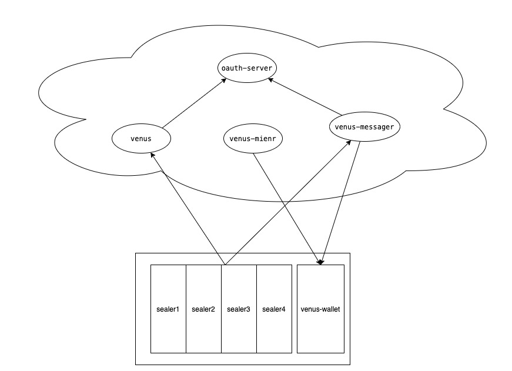
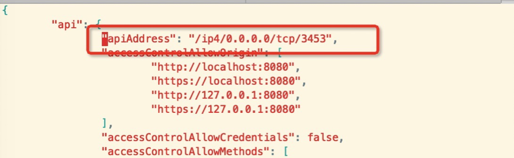

# How to Deploy Distributed mining pool

分布式矿池系统包含venus， venus-miner, venus-wallet, venus-messager, venus-sealer五个组件，五个组件分为两类，第一类是可共享的组件包括venus，venus-miner, venus-wallet, venus-messager这几个组件。运行在矿工本地主要用于积累算力的组件包括venus-sealer，venus-worker，venus-wallet。 venus-wallet属于可选组件，基于部署情况以及可信程度，venus-wallet既可以共享也可以本地部署。 本篇文档会以nerpda网络为例逐步的搭建矿池以及如何加入这个矿池。



## 共享组件搭建

### auth 组件搭建
auth用于统一授权，当矿工组件访问共享组件的时候需要配置先获取token

编译授权组件
```sh
git clone https://github.com/ipfs-force-community/venus-auth.git
make
```


运行授权组件
```sh
 ./auth-server
```
auth服务启动后，默认监听端口8989，此处auth服务的地址称为 ***auth url***

获取组件间访问token,此处称为 ***admin token***
```sh
 ./auth-server genToken --perm admin admin
```


### venus
venus节点组件用于其他组件查询链上信息，推送消息，区块。

编译节点组件
```sh
git clone https://github.com/filecoin-project/venus.git
make deps
make
```

运行节点，同步数据
```sh
./venus daemon --network nerpda --authURL <auth url>
```

修改配置文件，打开外部端口



获取api地址, 此处成为***venus api***
```sh
cat ~/.venus/api      #此处如何ip是127.0.0.1需要修改配置文件的api监听地址，如果是0.0.0.0使用的时候需要改用具体的地址
```

为了避免单节点故障,venus最好配置负载均衡:**[venus_load_balancing](./venus_load_balancing.md)**

### venus-miner
venus-miner组件用于出块打包消息，可以配置多个矿工，本程序会计算各自的出块机会，并通过远程请求sealer来获取数据证明。

编译miner组件
```sh
git clone https://github.com/filecoin-project/venus-miner.git
make nerpanet
```

运行miner组件, 首先需要写入访问节点的api及其token
```sh
mkdir ~/.venus
echo <venus api> > ~/.venus/api       #api从节点中获取
echo <admin token> > ~/.venus/token   #token从节点中获取
```

运行挖矿软件

```sh
TRUST_PARAMS=1 ./venus-miner init --actor <addr> --sealer-listen-api <sealer api> --sealer-token <sealer token>  --wallet-listen-api <local wallet api> --wallet-token <local wallet token>
TRUST_PARAMS=1 ./venus-miner run
```

### venus-messager

messager用户管理集群中所有的消息，保证消息上链，控制消息的流量，重试等。messager对接多个钱包，扫描其地址，监控这些地址所属交易的状态，接收这些地址发送的消息服务

编译messager组件
```sh
git clone https://github.com/ipfs-force-community/venus-messager.git
make deps
make
```

创建配置文件：messagr.toml
```sh
./venus-messager run --auth-url <auth url> --node-url <node api> --node-token <admin token> --db-type <mysql> --mysql-dsn <mysql dsn>
```

运行messager组件，按需修改messager.toml配置文件，node下的url和token 配置成节点中获取的地址和token，jwt 中的url是 auth 服务的
url，若数据库使用mysql，则需要把db.mysql 中的配置补充完整
```toml

[api]
  Address = "0.0.0.0:39812"

[db]
  type = "mysql"

  [db.mysql]
    connMaxLifeTime = "1m0s"
    connectionString = "xxxxx"
    debug = false
    maxIdleConn = 10
    maxOpenConn = 10

  [db.sqlite]
    debug = false
    path = "./message.db"

[jwt]
    url= <auth url> # 不连接auth服务则填: http://127.0.0.1:8989

[log]
  path = "messager.log"
  level = "info"  # log level: trace debug info warn|warning error fatal panic

[messageService]
  skipProcessHead = false
  skipPushMessage = false
  tipsetFilePath = "./tipset.json"

[messageState]
  CleanupInterval = 86400
  DefaultExpiration = 259200
  backTime = 86400

[node]
  url = <venus api>   #修改此处
  token = <admin token> #修改此处

[wallet]
  scanInterval = 10
```

执行命令
```sh
./venus-messager -c ./messager.toml
```
启动服务后，默认监听端口39812， messager的服务地址成为***messager url***

## 配置矿工启动本地组件

本地组件用于本地封装算力。sealer部分是必选的，wallet部分则属于可选的，可以几个sealer集群共享一个wallet，也可以每个sealer单独配备一个wallet。可以根据实际需求来处理。

### 获取本地token
为了访问公共组件需要向公共组件提交矿工信息（此处用名字testminer为例子），生成一个访问公共组件所需的token，此处称为 ***local token***

公共组件维护人员在auth组件上运行命令

```sh
 ./auth-server genToken --perm write testminer
```
### venus-wallet
钱包用于保管私钥，对外提供签名服务，以及签名策略。

编译钱包组件
```sh
git clone https://github.com/ipfs-force-community/venus-wallet.git
make
```

运行钱包组件
```sh
./venus-wallet run
```

设置钱包密码
```sh
./venus-wallet set-password
```

创建新地址
```sh
./venus-wallet new bls
```

获取钱包授权token及地址，此处成为***local wallet token***, ***local wallet api***
```sh
./venus-wallet auth api-info --perm sign
```
### 创建地址
在钱包上创建一个地址
```sh
./venus-wallet new bls
```

从水龙头领取一笔资金***https://faucet.nerpa.interplanetary.dev/funds.html***

### 编译sealer组件
```
git clone https://github.com/filecoin-project/venus-sealer.git
make deps
make
```

### 初始化sealer矿工
```sh
#不存在矿工
./venus-sealer init --worker <worker> --owner <owner> --sector-size 512M --network nerpa --node-url <venus api> --node-token <local token> --messager-url <messager url> --messager-token <local token> --wallet-name testminer


#初始化已存在矿工
./venus-sealer init --actor <actor>  --network nerpa --node-url <venus api> --node-token <local token> --messager-url <messager url> --messager-token <local 
```

### 运行矿工
```sh
./venus-sealer run
./venus-sealer sectors pledge #封装算力
```


获取sealer的token及地址，此处成为***sealer token***, ***sealer api***
```sh
cat ~/.venussealer/api  #此处如何ip是127.0.0.1需要修改配置文件的api监听地址，如果是0.0.0.0使用的时候需要改用具体的地址
cat ~/.venussealer/token
```

## 共享组件上操作

### 注册钱包到messager
在messager上运行命令
```sh
./venus-messager wallet add --name testminer --url  <local wallet api> --token <local wallet token>
```
此命令运行后，messager会扫描钱包的地址，并对这些地址的消息进行控制管理。


### 加入联合挖矿
矿工初始化完成后，需要把这个矿工加入到venus-miner里面,在venus-miner机器上执行如下指令。此处需要访问sealer获取数据证明，需要访问wallet获取签名能力。
```sh
./venus-miner address add --addr <actor> --sealer-listen-api <sealer api> --sealer-token <sealer token> --wallet-listen-api <local wallet api> --wallet-token <local wallet token>
```