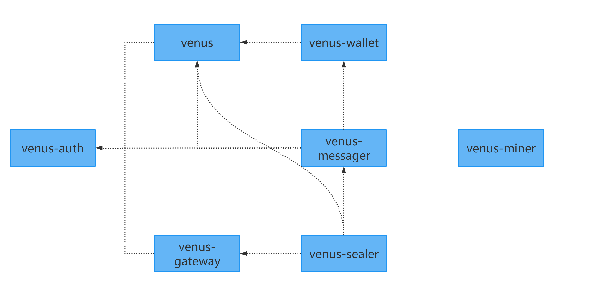

# venus项目依赖与升级

venus库对应的项目有: venus-auth,venus-gateway,venus-wallet,venus,venus-messager,venus-miner,venus-sealer.其依赖关系如下图所示:


## 升级顺序
&ensp;&ensp; 根据各项目的依赖关系图可知升级的顺序是：
1. venus-auth
2. venus，venus-gateway
3. venus-sealer，venus-messager，venus-wallet
* venus-miner不依赖其他组件,也不被其他组件依赖,可以随时升级.

&ensp;&ensp; 对于依赖其他组件的项目,须被依赖项目升级完成后才能最终确定升级版本,需要将go.mod更新为依赖组件的最新版本号,如venus-sealer依赖venus,venus-messager,venus-gateway,其对应的go.mod应具有以下格式:

```
...
github.com/filecoin-project/venus v0.9.7
github.com/filecoin-project/venus-messager v1.1.0
...
github.com/ipfs-force-community/venus-gateway v1.1.0
```

## 升级模块

&ensp;&ensp; 为了避免合并代码遗漏,在此记录venus每个组件升级时应查验的模块及代码目录.这里的升级特指lotus的升级,不考虑venus各组件因自身功能变化后的升级.

### venus-auth
&ensp;&ensp; lotus升级无影响

### venus

- 固定参数: 如升级高度,bootstrap,proof-params,car文件等;
    * venus: fixtures/networks;fixtures/_assets;
    * lotus: build
- api及命令行: 重要功能的api及cmd变化;
- spec-actor:
    * venus: pkg/specactors
    * lotus: chain/actors
    * go.mod 引用升级
- fork:
    * venus: pkg/fork
    * lotus: chain/stmgr
- vm:一般抓住版本变量及升级高度的引用位置即可,如: network::Version13,UpgradeHyperdriveHeight,StateTreeVersion3;
- 产生随机数逻辑,包括: ChainRandomness和BeaconRandomness;
- mpool: 消息选择逻辑及消息池进出逻辑变化;
- 区块验证: 包括消息验证,涉及同步;
    - venus: pkg/consensus
    - lotus: chain/sync.go
- filecoin-ffi
- comm-util: lotus升级后引入的libp2p, ipld,cbor等公共库的版本升级，升级相应go.mod
### venus-gateway

- go.mod

- 凡spec-actors的引用与lotus对比看有没有升级,如: github.com/filecoin-project/specs-actors/actors/runtime/proof --> github.com/filecoin-project/specs-actors/v5/actors/runtime/proof

- BuildVersion升级

### venus-wallet

- go.mod

- core/method.go init中加入最新的BuiltinActors
```
var actors []rt.VMActor
...
actors = append(actors, exported5.BuiltinActors()...)
```

- BuildVersion升级


### venus-messager

- go.mod

- filecoin-ffi

- 初始参数或消息处理逻辑有无变化


### venus-sealer

- go.mod

- cmd,特别是关于Sectors状态管理相关的

- storage-sealing: 可能会有配置项和依赖注入等变化
    * venus-sealer: storage-sealing;
    * lotus: extern/storage-sealing

- BuildVersion

- sector-storage: 可能会有配置项的变化

- filecoin-ffi

### venus-miner

- go.mod

- mining 基本流程有无变化

- filecoin-ffi

= spec-actor: chain/actors下代码升级

## 验证逻辑

&ensp;&ensp; 在升级前必须通过以下验证:

- 在 cali/nerpa 网络搭建集群能够正常增长算力并出块;

- 定制的lotus正常工作;

- 定制的lotus-miner接入venus服务能正常增长算力并出块

- RPC API Response 与 lotus 一致;
