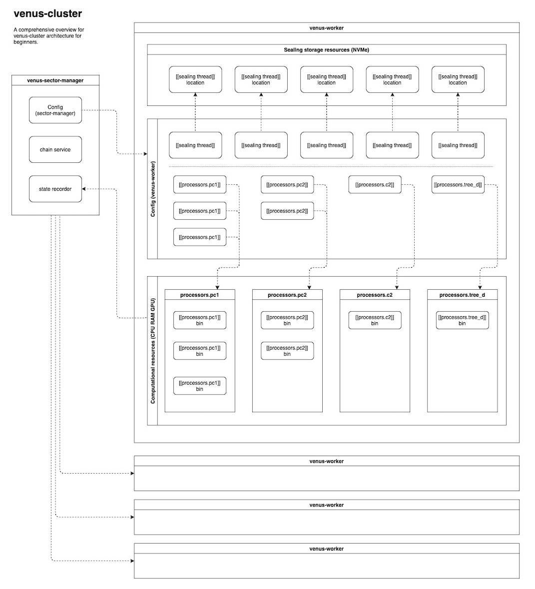

## 背景

`venus-cluster`诞生的大背景是，大量存储提供者加入到`Filecoin`存储提供网络之后，发现filecoin扇区封装过程中存在着种种问题和可以优化的部分。这边暂时列举了3个。

- 第一，调度问题，lotus-miner作为调度的核心，中心化负责扇区状态机的更新，导致管理和编排worker任务繁重，worker专攻某封装阶段的模式，造成扇区临时文件在集群中的无谓传输和磁盘io的浪费。
- 第二，扩容问题，调配或者扩容，封装管道的硬件和软件配置方案在现有lotus实现中对运维要求非常非常高，封装时需要用到的，计算和存储资源往往不能被有效利用。
- 第三，自定义代码问题，很多有研发背景的存储提供者对扇区封装的不同阶段可能会有一些自定义的代码优化，修改lotus代码之后，后期网络升级等造成的代码维护都是不小的挑战。

`venus-cluster`便是针对上述种种疼点，`Venus`研发团经过大量的运维实践和对技术的攻坚，最终形成的一套算力服务方案。

## 架构

`Sealer`是`Filecoin`中负责算力增长和算力维持的一个子系统。他之前由`lotus-miner`+`lotus-worker`体系亦或是由`venus-sealer`+`venus-worker`体系负责，而在`venus-cluster`中，`Sealer`子系统由`venus-sector-manager`+`venus-worker`的体系全权负责。需要注意的是由`venus-sealer`编译出来的`venus-worker`和`venus-cluster`中编译出来的`worker`是完全不一样的东西。

### 封装管道优化

需要注意的是`venus-cluster`的中一些独有的概念，从根本上改变了封装管道的架构。

- 第一个非常重要的概念，和当前封装模式完全不一样的是，使用venus-cluster封装单个扇区的过程会在一台机器上完成。这意味着扇区封装所需要的临时文件不会在集群之间做无谓的传输，浪费集群磁盘读写和网络资源。
- 第二个巨大的改变就是从以前lotus-miner或者venus-sealer主动的，中心化的管理worker的封装任务，到现在venus-worker自己能够自主的领任务，一台worker完成单个扇区的所有封装任务。
- 第三个，封装需要用到的计算和存储资源，深度，灵活的配置管理，使得封装任务资源隔离，互不相争，高效利用。为稳定，高产的封装管道保驾护航！

### 运维优化

基于上述的一些根本改变，`venus-cluster`在运维管理存储集群事也有多方面的优化。

With architectural changes of `venus-cluster`, it presents new streamlined ways of managing your storage system.

- 第一，时空证明worker与封装管道的完全解偶，windowPost和winningPost可单独部署在专门的机器上，防止资源竞争导致的windowPost失败和出块失败。避免集群收到惩罚，确保得到挖矿收益。
- 第二，部署复杂度大大降低，相同配置的硬件使用相同worker配置文件，使得部署速度大大提升，极大的方便了封装管道的横向扩容。
- 第三，得益于优化后的封装管道，封装任务现在有了更聪明的重试机制。在不得不需要人工介入的情况下，问题的快速定位。使得运维排查更加高效。

### 配置文件架构

深入展开`venus-cluster`配置架构，请看上面，`venus-sector-manager`，`venus-worker`, 和配置文件，和封装所需计算与存储资源，之间关系的一张大的架构图。左边是`sector-manager`。他有一份自己的配置文件。右边就是多个不同的`venus-worker`。我们深度展开第一个`venus-worker`，`venus-worker`包含三块内容，`venus-worker`机器上的存储资源（像是NVMe或者SSD的硬盘），然后中间的是，`venus-worker`自身的配置文件，最后，最下面的这个是venus-worker机器上计算资源（像是CPU，RAM，GPU）。

`sector-manager`配置文件指向`venus-worker`配置文件的箭头具体指的是，`venus-worker`部分配置可以从`sector-manager`继承，也可以覆盖`sector-manager`的部分配置。`venus-worker`配置文件中非常重要的2个配置，需要着重关注的是，`[[sealing_thread]]`和`[[processors]]`这2个配置。这2个配置分别代表了，封装管道优化一个很大的难点，即是存储资源和计算资源匹配的问题。

在`venus-worker`的配置文件中，`[[sealing_thread]]`配置了，封装任务的控制和存储资源的规划，而`[[processors]]`则配置了计算资源的规划。上图中在`venus-worker`配置文件中配置一个`[[sealing_thread]]`便会在`venus-worker`机器能够访问使用到的存储资源中画出一片区域。该区域将被用于存储单个扇区封装过程中的零食文件。每个`[[sealing_thread]]`画出的区域互不干扰。都将被用于存储，封装单个扇区所需的临时文件。那么单台`venus-worker`机器能同时封装扇区的最大数量便为 存储资源大小 / 扇区临时文件大小。举个例子，`venus-worker`机器有2000G的存储资源，封装扇区临时文件大小为520G，那么单台`venus-worker`机器能同时封装扇区的最大数量便为 2000 / 520。

那么最后，`[[processors]]`，`[[processors]]`配置对应的是计算资源的规划与相互隔离，上图中在`venus-worker`配置文件中配置一个`[[processors.pc1]]`便会在`venus-worker`机器的计算资源中画出一片区域，专门用于pc1任务的计算。如果像图中，配置了3个`[[processors.pc1]]`，那么该台`venus-worker`机器就能并行3个`pc1`。`[[processors.pc2]]`，`[[processors.c2]]`，`[[processors.tree_d]]`也是相同的道理。但是所有`[[processors]]`配置文件中的规划的计算资源总和不能超过该台`venus-worker`机器的计算资源。
 