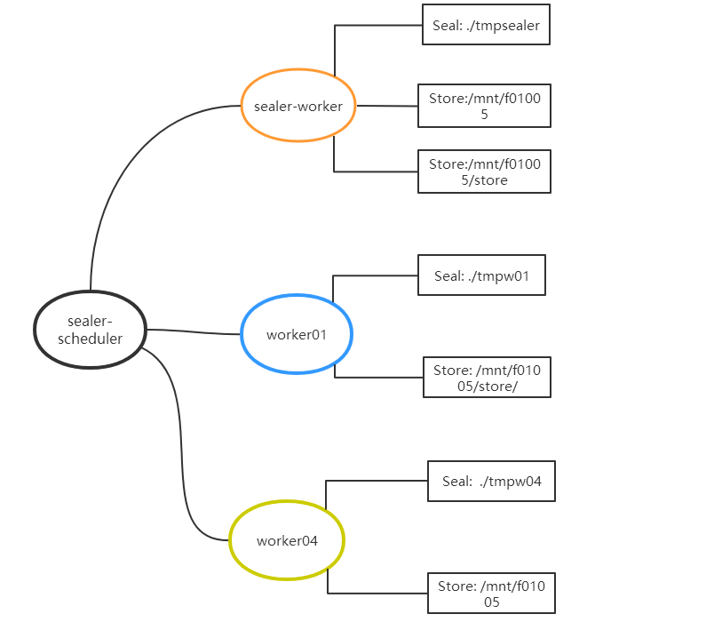

## 背景

&ensp;&ensp; 为了提升扇区封装效率,通常一个集群是多worker相互协作,共同完成扇区的封装任务.灵活配置worker的存储目录:包括临时目录和永久目录,有助于降低集群维护成本,节约网络带宽,一定程度上可以提升扇区封装效率.本文将介绍storage的配置及处理逻辑, 以便有需要的miner快速了解.

&ensp;&ensp; 本文档适用于`lotus-miner,lotus-worker` 或 `venus-sealer,venus-worker`的存储配置,需要有一定的运维和开发基础.

## 存储配置

&ensp;&ensp; 为了便于介绍,我们将`venus-sealer`和`lotus-miner`看做是worker,实际上,从封装扇区方面来说,`venus-sealer`和`lotus-miner`等价于: 任务调度器+worker;我们介绍的存储仅针对于worker而言.

&ensp;&ensp; 对于一个worker而言,存储分为两类:临时存储(seal)和永久存储(store).临时存储存放扇区封装各阶段(AP,P1,P2,Commit)产生的文件,永久存储存放扇区用于时空证明的文件,这部分文件需要在扇区生命周期内一直保存,一旦损坏或丢失,将面临一定的惩罚.

假设集群A的部署结构如下,其中venus-sealer,worker01和worker04在同一机器上运行,所有的永久存储也在同一机器上:



venus-sealer(127.0.0.1:2345) 视角下storage list:
```bash
./venus-sealer storage list
0d4174ac-d8c7-4109-9f07-d77616a46aa3:
        [#########                                         ] 208.6 GiB/1.072 TiB 19%
        Unsealed: 0; Sealed: 0; Caches: 0; Reserved: 0 B
        Weight: 10; Use: Seal 
        Local: ./tmpsealer/
        URL: http://127.0.0.1:2345/remote

1b5bbc5b-070b-40ca-9a76-28366a183126:
        [#########                                         ] 208.6 GiB/1.072 TiB 19%
        Unsealed: 2; Sealed: 2; Caches: 2; Reserved: 0 B
        Weight: 10; Use: Seal 
        Groups: w01
        AllowTo: w01
        URL: http://127.0.0.1:3458/remote (latency: 800µs)

289648f2-ae57-460e-870f-00af5bd22fe2:
        [#########                                         ] 208.6 GiB/1.072 TiB 19%
        Unsealed: 0; Sealed: 0; Caches: 0; Reserved: 0 B
        Weight: 10; Use: Seal 
        Groups: w04
        AllowTo: w04
        URL: http://127.0.0.1:3450/remote (latency: 1.1ms)

9a9dc07f-1add-4bd0-b7ab-3f7689e026a9:
        [#########                                         ] 208.6 GiB/1.072 TiB 19%
        Unsealed: 0; Sealed: 3; Caches: 3; Reserved: 0 B
        Weight: 8; Use: Store
        Local: /mnt/f01005/store
        URL: http://127.0.0.1:3458/remote
        URL: http://127.0.0.1:2345/remote

cdd3845d-74e8-418d-a37b-e05bd5926aee:
        [#########                                         ] 208.6 GiB/1.072 TiB 19%
        Unsealed: 0; Sealed: 34; Caches: 34; Reserved: 0 B
        Weight: 10; Use: Store
        Local: /mnt/f01005/
        URL: http://127.0.0.1:2345/remote
        URL: http://127.0.0.1:3450/remote
```

worker01(127.0.0.1:3458) 视角下storage list:
```bash
 ./venus-worker --repo=./tmpw01 info
Worker version:  1.1.0
...
Task types: FIN GET UNS C1 C2 PC2 PC1 AP 

1b5bbc5b-070b-40ca-9a76-28366a183126:
        Weight: 10; Use: Seal 
        Local: ./tmpw01
9a9dc07f-1add-4bd0-b7ab-3f7689e026a9:
        Weight: 8; Use: Store
        Local: /mnt/f01005/store/
```

worker04(127.0.0.1:3450) 视角下storage list:
```bash
./venus-worker --repo=./tmpw04 info
Worker version:  1.1.0
...
Task types: FIN GET UNS C1 C2 PC2 PC1 AP 

cdd3845d-74e8-418d-a37b-e05bd5926aee:
        Weight: 10; Use: Store
        Local: /mnt/f01005
289648f2-ae57-460e-870f-00af5bd22fe2:
        Weight: 10; Use: Seal 
        Local: ./tmpw04
```

可以看出: (1)每个worker各自设置了不同的`seal storage`; (2)worker04和venus-sealer设置了相同的永久存储; (3)venus-sealer的永久存储有两个是为了保证时空证明时能访问所有的扇区文件.


### 命令

store storage:

```
./venus-sealer storage attach --store [--init] <PATH>

./venus-worker storage attach --store [--init] <PATH>
```
如果路径是第一被设置,需要加`--init`.

seal storage:

```
./venus-worker storage attach --seal [--init] [--groups] [--allow-to] <PATH>

```
如果要绑定P1,P2阶段任务,需要对临时存储(`seal storage`) 分组,`groups`标识属于那些组,`allow-to`标识P1结束后P2可由那些组的worker领取.


## 任务调度与存储

- 在 sealer 的调度器中, 会维持多个`window`(即`schedWindowRequest`),每个`window`都包含特定worker的标识(`worker WorkerID`).一旦有新的扇区任务,会从所有`window`中根据对应worker的存储空间余量,可用资源(如cpu,内存等),选择一个最优的`window`下发任务;

分配扇区任务时调度器中有关`window`日志：
```
SCHED windows: [{allocated:{memUsedMin:0 memUsedMax:0 gpuUsed:false cpuUse:0 cond:<nil>} todo:[]} {allocated:{memUsedMin:0 memUsedMax:0 gpuUsed:false cpuUse:0 cond:<nil>} todo:[]} {allocated:{memUsedMin:0 memUsedMax:0 gpuUsed:false cpuUse:0 cond:<nil>} todo:[]} {allocated:{memUsedMin:0 memUsedMax:0 gpuUsed:false cpuUse:0 cond:<nil>} todo:[]} {allocated:{memUsedMin:0 memUsedMax:0 gpuUsed:false cpuUse:0 cond:<nil>} todo:[]} {allocated:{memUsedMin:0 memUsedMax:0 gpuUsed:false cpuUse:0 cond:<nil>} todo:[]}]
```

可以领取任务的`window`,即 `acceptableWindows`
```
SCHED Acceptable win: [[4 5]]
```

如果有多个`acceptableWindows`,则按下标顺序从小到大尝试派发任务,只有前面的派发失败才会尝试后面的,一旦派发成功则退出循环.
```
2021-12-22T16:45:03.603+0800    DEBUG   advmgr  sector-storage/sched.go:466     SCHED try assign sqi:0 sector 40 to window 4
2021-12-22T16:45:03.603+0800    DEBUG   advmgr  sector-storage/sched.go:473     SCHED ASSIGNED sqi:0 sector 40 task seal/v0/fetch to window 4
```

:::tip 

(1) worker并不是主动做任务的,而是由`scheduler`控制的; 

(2) worker被分配任务优先级与系统资源有关,可用资源越多,排序就会越靠前;

(3) `window` 的排序及选择是可以改变的;

(4) `window` 的很多选择是不会考虑扇区前一阶段的文件存储位置的,这也是为什么时常存在拷贝的原因.

:::

- worker在执行任务可以分为两个阶段: (1)prepare阶段: 获取任务所需扇区文件,如果本地存储目录不存在,则从其他worker请求; (2) work阶段: 执行任务. 期间产生网络带宽通常有两种情形:
    - 所需文件在别的worker存储目录下,且两个存储目录不在同一机器.一旦同时刻存在大量这样的传输,就会造成网络卡顿,影响集群扇区封装效率.为避免这种情况,通常设置P1任务由同一机器上的P2-worker进行.
    - worker的永久存储和扇区临时文件不在同一目录.如扇区完成后需要将永久文件从扇区所在的临时存储拷贝到改worker设置的永久存储.如果该worker的永久存储和扇区所在临时存储不在同一机器,一样会产生网络带宽.

- 改变任务调度的方式:

&ensp;&ensp; (1) 在`window` --> `acceptableWindows` 会判断每个`window`是否满足条件，可以在其调用函数(OK)中将不想要的排除;

&ensp;&ensp; (2) `acceptableWindows` 按一定的规则进行排序，可在其调用函数(Cmp)中编写想要的规则;

### 实例

- 扇区完成(C2消息上链)后,怎么优先让扇区文件所在的worker执行永久文件的拷贝?

&ensp;&ensp; 改变 `acceptableWindows` 的排序规则,让能找到扇区文件的排前面.

- 绑定P1,P2阶段在同一机器进行?

&ensp;&ensp; 对临时存储(`seal storage`)分组.
