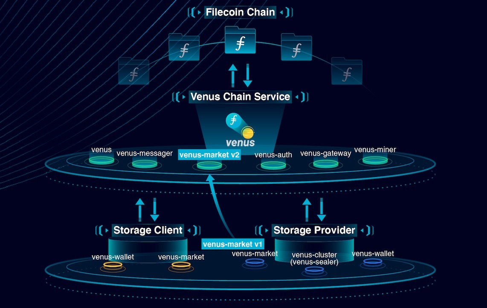

## 背景

考虑到庞大的初始硬件和Filecoin质押[投资](https://filscan.io/calculator)以及相关的运营成本，开始Filecoin存储提供是一项艰巨的任务。 囊括了分布式部署架构，订单服务和算力服务，Venus将帮助存储提供者，如社区所说，把[全职工作](https://filecoinproject.slack.com/archives/CEGN061C5/p1610810730117900?thread_ts=1610809298.116800&cid=CEGN061C5)变成为一个对运维更加友好的解决方案。 希望本教程能让您立即开始存储提供！

## 如何提供存储服务

有两种方法可以开始使用Venus来提供存储服务。

1. 部署最少的硬件并获得第三方venus链服务的帐号。(本教程的其余部分将引导您完成这种部署Venus服务的方式)
2. 自行部署venus链服务。(请参阅[这个](How-To-Deploy-MingPool.md)教程以了解更多信息)

在遵循其余的教程和成功部署后，您可以开始封装扇区，增加算力并通过您对网络存储容量的贡献最终获得区块奖励！

## venus组件介绍

根据其在挖矿集群中的作用，模块可以大致分为两类：链服务组件和本地组件。 链服务可以被认为是开始封装扇区所需的基础。 大多数与区块链的交互，如链同步、发送消息、赢得赢票等，都是由链服务处理的。 这个想法是许多存储提供者都可以共用一套链服务，从而减少维护成本。 本地组件提供了一整套算力服务。如果您选择使用第三方托管的Venus链服务，您只要将花费大部分时间在独立模块上。 另请注意，`venus-market`和`venus-wallet`模块可以作为链服务或本地组件部署。

| name                                                         | role                                                  | Chain_Service/Local |
| ------------------------------------------------------------ | ----------------------------------------------------- | ------------------ |
| [venus](https://github.com/filecoin-project/venus)           | daemon for chain interactions                         | Chain_Service             |
| [venus-miner](https://github.com/filecoin-project/venus-miner) | block winning and proving                             | Chain_Service             |
| [venus-messager](https://github.com/filecoin-project/venus-messager) | chain message management                              | Chain_Service             |
| [venus-auth](https://github.com/filecoin-project/venus-auth) | utility for authorized use of shared modules          | Chain_Service             |
| [venus-gateway](https://github.com/ipfs-force-community/venus-gateway) | utility for controlled access point of shared modules | Chain_Service             |
| [venus-wallet](https://github.com/filecoin-project/venus-wallet) | addresses/keys management                             | Chain_Service/Local |
| [venus-cluster](https://github.com/ipfs-force-community/venus-cluster) | job scheduling, sealing and proving                   | Local        |
| [venus-sealer](https://github.com/filecoin-project/venus-sealer), [venus-worker](https://github.com/filecoin-project/venus-sealer) | job scheduling, sealing and proving                   | Local        |
| [venus-market](https://github.com/filecoin-project/venus-market) | deal making                                           | Chain_Service/Local        |

## 服务架构

下图展示了venus模块如何相互交互。



## 硬件要求

在[此处](https://github.com/filecoin-project/community-china/discussions/18)了解有关硬件要求的更多信息。或者参阅我们的[单机配置示例](https://venus.filecoin.io/zh/operation/example-single-box.html)。

:::warning

使用`venus-cluster`时，请参阅`venus-cluster`[性能测试](https://mp.weixin.qq.com/s/AxEaV2iZT8-8jOKyMoFRvA)中，社区成员使用的硬件，并作出对自己的最优调整。如有问题可以寻求[Venus Master](https://venushub.io/master/)的帮助。

:::

## 前期准备

在深入部署您的挖矿操作之前，请确保您已完成以下步骤。

:::warning

建议您在部署到主网上之前在`calibration`网络中测试您的配置。

:::

### 永久存储

选择您熟悉的网络文件系统（例如 NFS）并部署您的存储集群。

### 在共享模块中设置您的帐户

有两种方法可以配置您的帐户。

#### 对于需接入共享模块的用户

如果您尝试连接到第三方托管的共享venus模块，联系上述服务的管理员并让他们为您设置。

:::tip

venus-wallet 可以部署为链服务或者本地组件，具体取决于您的安全要求。

:::

#### 对于共享模块的管理员

如果您是托管共享 venus 模块的管理员，请使用以下命令注册各个集群。

```bash
# 创建user
$ ./venus-auth user add --name <ACCOUNT_NAME>
# 激活user
$ ./venus-auth user update --name <ACCOUNT_NAME> --state 1
# 绑定节点号
$ ./venus-auth user miner add <ACCOUNT_NAME> <MinerID>

# 为此账号分配token，用于接入服务层验证
$ ./venus-auth token gen --perm write <ACCOUNT_NAME>
<AUTH_TOKEN_FOR_ACCOUNT_NAME>
```

### 软件依赖

在运行`Venus`之前，您需要安装[这些](https://lotus.filecoin.io/lotus/install/linux/#software-dependencies)软件。（注：和lotus的软件依赖相同）

## 安装venus-wallet

下载并编译`Venus-wallet`的源代码。

- 首次编译

```bash
$ git clone https://github.com/filecoin-project/venus-wallet.git
# change directory to venus-wallet
$ cd venus-wallet
$ git checkout <LATEST_RELEASE>
$ make
```

- 曾经成功编译过

```bash
# change directory to venus-wallet,switch to the incubation branch
$ git fetch
$ git pull
```

在后台运行`venus-wallet`模块。

```bash
$ nohup ./venus-wallet run > wallet.log 2>&1 &
```

:::tip 

使用 `tail -f wallet.log` 来监控钱包日志。

:::

为您的`venus-wallet`设置密码

```bash
$ ./venus-wallet setpwd
Password:******
Enter Password again:******
Password set successfully
```

:::warning

请备份您的密码并妥善保存，否则你将无法使用wallet相关的功能。每次venus-wallet run启动时带--password标志会自动解锁钱包,如果没带,在wallet实例启动后你需要手动解锁:
```bash
$ ./venus-wallet unlock
Password: 

# 查看解锁状态
$ ./venus-wallet lock-state
wallet state: unlocked
```
在扇区封装的过程中需要调用wallet进行签名,如果不解锁,会导致签名失败,进而导致扇区任务失败.

:::

生成owner和worker地址。（如果您没有现有的miner ID）

```bash
$ ./venus-wallet new bls
<OWNER_ADDRESS>
$ ./venus-wallet new bls
<WORKER_ADDRESS>
```

:::tip

如果您在`Calibration`上进行测试，则必须使用来自水龙头的测试币为您的所有地址提供资金。对于校准网，请使用此[水龙头](https://faucet.calibration.fildev.network/funds.html)。

:::

***配置venus-wallet接入共享服务,使用您从共享模块管理员处获得的帐号信息更改 `~/.venus_wallet/config.toml`中的`[APIRegisterHub]` 部分***

```toml
[APIRegisterHub]
RegisterAPI = ["/ip4/<IP_ADDRESS_OF_VENUS_GATEWAY>/tcp/45132"]
Token = "<AUTH_TOKEN_FOR_ACCOUNT_NAME>"
SupportAccounts = ["<ACCOUNT_NAME>"]
```

重新启动`venus-wallet`以使更改生效。

```bash
# grep [PID] of venus-wallet process
$ ps -ef | grep wallet
# kill the process and restart
$ kill [PID]
$ nohup ./venus-wallet run > wallet.log 2>&1 &
```

如成功连接 `venus-gateway`，您将看到以下日志。

```bash
2021-07-12T15:14:12.457+0800    INFO    wallet_event    wallet_event/listenevent.go:197 connect to server fcf714b2-eeb6-498b-aafc-5e58eccd9d0f  {"api hub": "/ip4/<IP_ADDRESS>/tcp/45132"}
```

:::tip

建议使用`systemd`或`supervisord`等线程控制。

:::

:::warning

请确保venus-wallet 处于unlocked状态，要么会在Sealer模块初始化时卡在 "Waiting for confirmation"，导致miner帐号生成不了。

:::

## 安装venus-cluster

下载代码。

```bash
$ git clone https://github.com/ipfs-force-community/venus-cluster.git
```

编译`venus-cluster`。

```bash
$ cd venus-cluster
$ git checkout <LATEST_RELEASE>
$ make all
```

:::tip
编译完成后，会在 ./dist/bin 目录下有`venus-worker`和`venus-sector-manager`两个可执行文件。
:::

### 创建矿工号（可选）

创建矿工号。（如果已经有矿工号可以跳过此步）

```bash
$ ./venus-sector-manager util miner create 
--from=<OWNER_ADDRESS> 
--owner=<OWNER_ADDRESS> 
--worker=<WORKER_ADDRESS>
--sector-size=32GiB
```
:::tip
使用`--net`来选择网络，默认为主网。
:::

:::tip
成功创建矿工号会有类似以下日志输出：

```bash
2022-05-09T07:29:51.325Z  INFO  cmd  internal/util_miner.go:242  miner actor: t01219 (t2z4nnndtt2iuu57lq3ivor7xdvqwivwb5renrh3a)  
{"size": "512MiB", "from": "t3wultr2i47m24ew2p3bskclnb4rtgmuwb6cwjleqbeu4ndqocx67635dibpsq3ugpbv5y7fpjlpxlmkqcgnva", 
"actor": "t01166", "owner": "t3wultr2i47m24ew2p3bskclnb4rtgmuwb6cwjleqbeu4ndqocx67635dibpsq3ugpbv5y7fpjlpxlmkqcgnva", 
"worker": "t3wultr2i47m24ew2p3bskclnb4rtgmuwb6cwjleqbeu4ndqocx67635dibpsq3ugpbv5y7fpjlpxlmkqcgnva"}
```
:::

### venus-sector-manager

初始化工作目录

```bash
./dist/bin/venus-sector-manager daemon init
```

按需配置默认配置文件`~/.venus-sector-manager/sector-manager.cfg`。这里给出一份参考，详细配置说明可以参见[这里](/zh/cluster/Venus-Sector-Manager)。

```toml
[Common]
  [Common.API]
    # 链服务地址，必填项，字符串类型
    Chain = "/ip4/{api_host}/tcp/{api_port}"
    # 消息服务地址，必填项，字符串类型
    Messager = "/ip4/{api_host}/tcp/{api_port}"
    # 市场服务地址，封装真实数据时为必填项，字符串类型，CC数据非必填项
    # Market = "/ip4/{api_host}/tcp/{api_port}"
    # 网关服务地址，必填项，字符串类型
    Gateway = "/ip4/{api_host}/tcp/{api_port}"
    # 服务 token， 必填项，字符串类型
    Token = "{auth token}"
   
[[Common.PieceStores]]
  # 路径，必填项，字符串类型
  #Path = "{store_path}"
   
[[Common.PersistStores]]
  # 名称， 选填项，字符串类型
  Name = "{store_name1}"
  # 路径，必填项，字符串类型，建议使用绝对路径
  Path = "{store_path1}"
   
[[Common.PersistStores]]
  Name = "{store_name2}"
  Path = "{store_path2}"
   
[[Miners]]
  # `SP` actor id， 必填项，数字类型，t033680->33680
  Actor = 33680
   
  [Miners.Sector]
    # 扇区起始编号，选填项，数字类型，默认值为 0
    InitNumber = 0
    # 扇区编号上限，选填项，数字类型，默认值为 null， 表示无上限限制
    MaxNumber = 1000000
    # 是否允许分配扇区， 选填项，布尔类型，默认值为 true， 即开启分配
    Enabled = true
    # 真实订单
    EnableDeals = true
   
  [Miners.Commitment.Pre]
    # 发送地址，必填项，地址类型，miner的worker地址
    Sender = "t3vi4amwofexsfpontn5g722psgikzochthhhu3ptvofzrqmgajs67gt5n2ririlc4hj667dvfsn3kmxiwgtya"
    # 单条提交消息的 Gas 估算倍数，选填项，浮点数类型，默认值为1.2
    #GasOverEstimation = 1.2
    # 单条提交消息的FeeCap 限制，选填项，FIL值类型，默认值为 5 nanoFIL
    #MaxFeeCap = "5 nanoFIL"
   
  [Miners.Commitment.Pre.Batch]
    # 是否启用聚合提交，选填项，布尔类型，默认值为 false， 即不启用
    Enabled = true
    # 最小聚合条数，选填项，数字类型，默认值为 16，即最小聚合条数为 16条
    #Threshold = 16
    # 最大等待时间，选填项，时间类型，默认值为 1h，即最大等待 1 小时
    #MaxWait = "1h0m0s"
    # 检查间隔，选填项，时间类型，默认值为 1min，即每隔 1min 检查一次是否满足聚合条件
    #CheckInterval = "1m0s"
    # 聚合提交消息的 Gas 估算倍数，选填项，浮点数类型，默认值为 1.2
    #GasOverEstimation = 1.2
    # 聚合提交消息的FeeCap 限制，选填项，FIL值类型，默认值为 5 nanoFIL
    #MaxFeeCap = "5 nanoFIL"
   
  #用于配置 ProveCommit 消息提交的策略，其配置项和作用与 Miners.Commitment.Pre内的完全一致。
  [Miners.Commitment.Prove]
    Sender = "t3vi4amwofexsfpontn5g722psgikzochthhhu3ptvofzrqmgajs67gt5n2ririlc4hj667dvfsn3kmxiwgtya"
    #GasOverEstimation = 1.2
    #MaxFeeCap = "5 nanoFIL"
   
  [Miners.Commitment.Prove.Batch]
    Enabled = true
    #Threshold = 16
    #MaxWait = "1h0m0s"
    #CheckInterval = "1m0s"
    #GasOverEstimation = 1.2
    #MaxFeeCap = "5 nanoFIL"
   
  [Miners.PoSt]
    # 发送地址，必填项，地址类型
    Sender = "t3vi4amwofexsfpontn5g722psgikzochthhhu3ptvofzrqmgajs67gt5n2ririlc4hj667dvfsn3kmxiwgtya"
    # 是否启用，选填项，布尔类型，默认值为 true
    Enabled = true
    # 是否对扇区文件进行强校验，选填项，布尔类型，默认值为 true
    # 开启时，除了对文件存在性进行判断外，还会尝试读取部分信息，如元数据等
    #StrictCheck = true
    # WindowPoSt 消息的 Gas 估算倍数，选填项，浮点数类型，默认值为 1.2
    #GasOverEstimation = 1.2
    # WindowPoSt 消息的FeeCap 限制，选填项，FIL值类型，默认值为 5 nanoFIL
    #MaxFeeCap = "5 nanoFIL"
    # 消息的稳定高度，选填项，数字类型，默认值为 10
    #Confidence = 10
   
  [Miners.Proof]
    # 是否启用，选填项，布尔类型，默认值为 false
    Enabled = true
   
  [Miners.Deal]
    # 是否启用订单，选填项，布尔类型，默认值为 false
    Enabled = true
```

启动`venus-sector-manager`

```bash
$ ./dist/bin/venus-sector-manager --net=cali daemon run --poster --miner --listen 0.0.0.0:1789
```

:::tip
使用`--net`来选择网络，默认为主网。
:::

### venus-worker

规划用于封装过程中数据的本地存储，并使用以下命令创建并初始化数据目录。

```bash
$ ./dist/bin/venus-worker store sealing-init -l <dir1> <dir2> <dir3> <...>
```

挂载持久化数据目录，并使用以下命令初始化数据目录。

```bash
$ ./dist/bin/venus-worker store file-init -l <dir1>
```

规划用于各封装阶段的CPU核、numa 区域等配置。按需完成配置文件。以下为`worker`配置例子，更详细的配置项、作用、配置方法可以参考[这个](/zh/cluster/Venus-Worker-c)文档。

```toml
[worker]
  # 实例名，选填项，字符串类型，默认以连接 `venus-sector-manager` 所使用的网卡 IP 地址作为实例名
  # name = "bytest"
  # rpc 服务监听地址，选填项，字符串类型， 默认为"0.0.0.0"，即监听本机所有地址
  # rpc_server.host = "0.0.0.0"
  # rpc 服务监听端口，选填项，数字类型，默认为17890
  # rpc_server.port = 17890

[sector_manager]
  # 构造 rpc 客户端时使用的连接地址，必填项，字符串类型
  rpc_client.addr = "/ip4/{some_ip}/tcp/1789"
  # rpc_client.headers = { User-Agent = "jsonrpc-core-client" }
  # piece_token = "{auth token}"

[sealing]
  # 允许的`SP`，选填项，数字数组格式
  allowed_miners = [33680]
  # 允许的扇区大小，选填项，字符串数组格式，["32GiB", "64GiB"]
  allowed_sizes = ["32GiB","64GiB"]
  # 是否允许向扇区内添加订单，选填项，布尔类型，默认为 false。
  # 当设置为 true 时，通常需要同时设置 `sector_manager` 中的 `piece_token` 项
  # enable_deals = true
  # 封装过程中遇到 temp 类型的错误时，重试的次数，选填项，数字格式，默认为 5
  # max_retries = 3
  # 封装过程中遇到 temp 类型的错误时，重试的间隔，选填项，时间字符串格式，默认为 “30s"， 即30秒
  # seal_interval = "30s"
  # 空闲的 `sealing_store` 申请封装任务的间隔， 选填项，时间字符串格式，默认为 ”30s"， 即30秒
  # recover_interval = "30s"
  # rpc 状态轮询请求的间隔，选填项，时间字符串格式，默认为 ”30s"， 即30秒
  # 封装过程中，部分环节使用了轮询方式来获取非实时的信息，如消息上链等。这个值有助于避免过于频繁的请求占用网络资源
  # rpc_polling_interval = "30s"
  # 是否跳过 proof 的本地校验环节，选填项，布尔格式，默认为 false
  # ignore_proof_check = false

# 根据实际资源规划
[[sealing_thread]]
  # 扇区数据目录路径，必填项，字符串类型，建议使用绝对路径，数据目录和工作线程是一对一绑定的
  location = "{path to sealing store1}"
  # 封装过程的定制参数，仅对当前工作线程生效
  # sealing.allowed_miners = [10123, 10124, 10125]
  # sealing.allowed_sizes = ["32GiB", "64GiB"]
  # sealing.enable_deals = true
  # sealing.max_retries = 3
  # sealing.seal_interval = "30s"
  # sealing.recover_interval = "30s"
  # sealing.rpc_polling_interval = "30s"
  # sealing.ignore_proof_check = false

[[sealing_thread]]
  location = "{path to sealing store2}"

[[sealing_thread]]
  location = "{path to sealing store3}"

[[sealing_thread]]
  location = "{path to sealing store4}"

[[sealing_thread]]
  location = "{path to sealing store5}"

[[sealing_thread]]
  location = "{path to sealing store6}"

[[sealing_thread]]
  location = "{path to sealing store7}"

[[sealing_thread]]
  location = "{path to sealing store8}"

# attached用于配置已完成的扇区持久化数据保存的位置，允许同时配置多个。
[[attached]]
  # 名称， 选填项，字符串类型，默认为路径对应的绝对路径
  name = "bytest"
  # 路径，必填项，字符串类型，建议直接填写绝对路径
  location = "/xx/xx/xxx"
  # 只读，选填项，布尔类型，默认值为 false
  #readonly = false

[processors.static_tree_d]
  32GiB = "{path to static tree_d for 32GiB}"
  64GiB = "{path to static tree_d for 64GiB}"

# 根据实际资源规划
[processors.limit]
  # pc1 阶段的并发数限制，选填项，数字类型
  pc1 = 4
  # pc2 阶段的并发数限制，选填项，数字类型
  pc2 = 2
  # c2 阶段的并发数限制，选填项，数字类型
  c2 = 1

# fields for pc1 processors
[[processors.pc1]]
  # numa 亲和性分区 id，选填项，数字类型，默认值为 null，不会设置亲和性，需要根据宿主机的 numa 分区进行填写
  numa_preferred = 0
  # cpu 核绑定和限制选项，选填项，字符串类型，默认值为 null，不设置绑定，值的格式遵循标准 cgroup.cpuset 格式
  cgroup.cpuset = "0-7"
  # 声明本processor支持的最多并发量
  concurrent = 2
  # 外部执行器的附加环境变量，选填项，字典类型，默认值为 null
  envs = { FIL_PROOFS_USE_MULTICORE_SDR = "1" }

[[processors.pc1]]
  numa_preferred = 1
  cgroup.cpuset = "12-19"
  concurrent = 2
  envs = { FIL_PROOFS_USE_MULTICORE_SDR = "1" }

[[processors.pc2]]
  cgroup.cpuset = "8-11,24-27"
  envs = { FIL_PROOFS_USE_GPU_COLUMN_BUILDER = "1", FIL_PROOFS_USE_GPU_TREE_BUILDER = "1", CUDA_VISIBLE_DEVICES = "0" }

[[processors.pc2]]
  cgroup.cpuset = "20-23,36-39"
  envs = { FIL_PROOFS_USE_GPU_COLUMN_BUILDER = "1", FIL_PROOFS_USE_GPU_TREE_BUILDER = "1", CUDA_VISIBLE_DEVICES = "1" }

[[processors.c2]]
  cgroup.cpuset = "28-35"
  envs = { CUDA_VISIBLE_DEVICES = "2,3" }

[[processors.tree_d]]
  cgroup.cpuset = "40-45"
```
:::tip
您也可以参考社区`venus-cluster`性能测试的相关[技术文档](https://github.com/filecoin-project/venus/discussions/4866)，作为参考。
:::

使用启动`venus-worker`。

```bash
$ /path/to/venus-worker daemon -c /path/to/venus-worker.toml
```

:::tip
以上关于sector-manager.cfg和venus-worker.toml配置文件只是一份最简单的可运行配置，其他配置的详细信息可参[这些文档](/zh/cluster/)。
:::

:::tip
关于配置文件需要注意的是：`venus-worker.toml`的`[[attached]]`中的`name = "xxx"` 和路径要与`sector-manager.cfg`中的`[[Common.PersistStores]] Name = "xxx"`和路径一致。
:::

## 问题?

来[Slack](https://filecoinproject.slack.com/archives/C028PCH8L31)上找我们吧！
