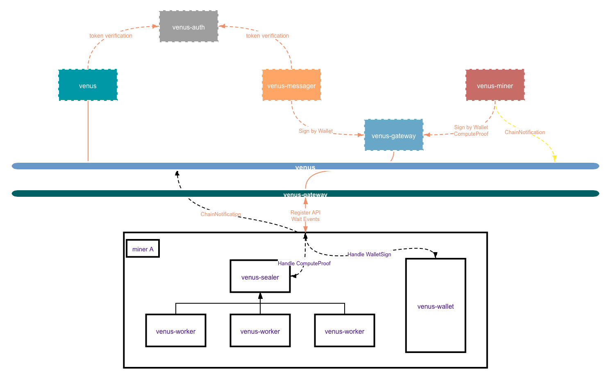

## Venus 矿池架构

&ensp;&ensp;Venus架构设计中包括 *[‘venus’](https://github.com/filecoin-project/venus)、[’venus-auth’](https://github.com/filecoin-project/venus-auth)、[‘venus-miner’](https://github.com/filecoin-project/venus-miner)、[‘venus-messager’](https://github.com/filecoin-project/venus-messager)、[’venus-gateway’](https://github.com/ipfs-force-community/venus-gateway)、[‘venus-wallet’](https://github.com/filecoin-project/venus-wallet)、[‘venus-sealer’](https://github.com/filecoin-project/venus-sealer)* ，以及 *[‘venus-market’](https://github.com/filecoin-project/venus-market)*。以功能划分纬度，将所有组件分为**共享组件（链服务）和独立组件**，这样在很大程度上解放了存储提供者的一些精力，不再被消息无法上链、区块同步错误等问题纠缠，而拥有技术实力及硬件资源的服务商可以搭建共享组件给分布在全球各地的存储提供者提供服务，从中获取一定的服务费用等。当然，如果存储提供者自身拥有多个集群并有一定技术能力，完全可以自行搭建链服务。

&ensp;&ensp;下图是设想中的一个典型的应用场景，在此场景中一套独立组件（venus-sealer、venus-worker、venus-wallet）负责一个集群的算力增长与维持，而这样的集群是很方便横向扩展的。

> 现阶段venus-market仅服务于单个集群，在不久的将来，将会成为服务组件的一部分，即一个venus-market可以服务多个集群。
 
Venus与Lotus组件间的对应关系如下所示，在实现了Lotus功能的基础上均有所扩展：

*  venus daemon --> lotus daemon
*  venus-auth --> token authentication service extend lotus jwt
*  venus-miner --> lotus-miner block produce part & multi miner
*  venus-messager --> lotus mpool
*  venus-wallet -> lotus wallet part
*  venus-sealer --> lotus-miner sealer scheduler part/wd
*  venus-market --> lotus-miner market part
*  venus-worker --> lotus-worker

## Venus 如何工作

&ensp;&ensp;有关每个venus组件如何工作的更多信息，请阅读此文档 [here](https://venus.filecoin.io/zh/guide/#venus如何工作).
