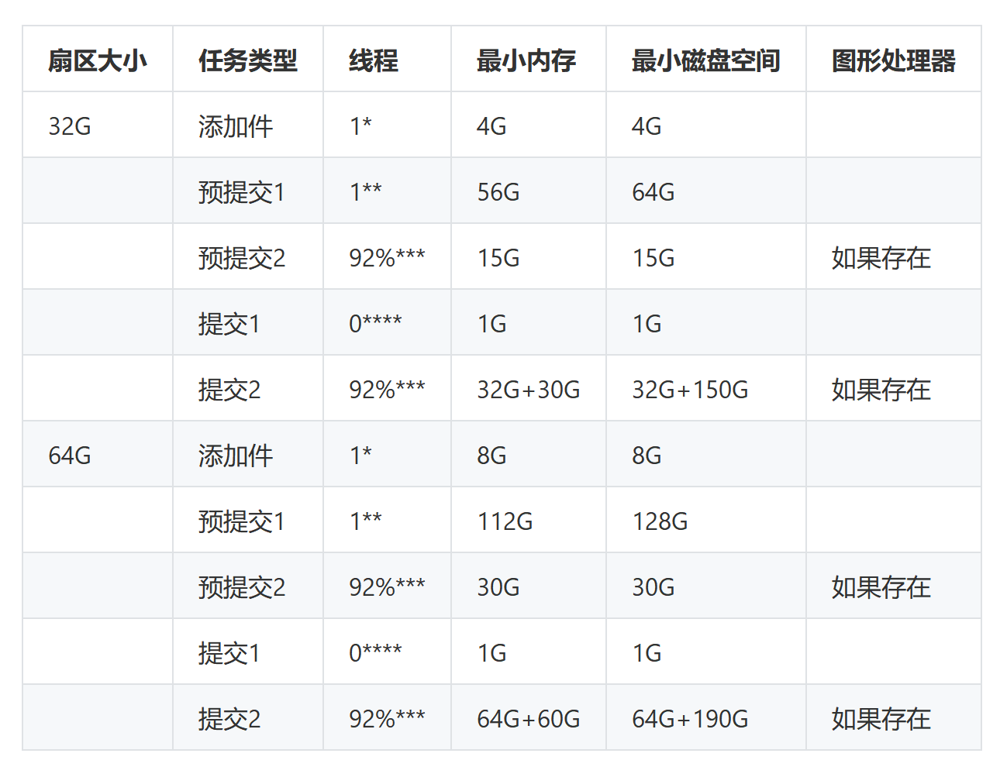

# 算力增长与维持

## 源码编译

&ensp;&ensp; 一些较新的CPU架构,如AMD的Zen和Intel的lce Lake,支持SHA扩展.启用这些扩展会明显加快扇区封装速度,这时请用源码编译filecoin-ffi:
```
export RUSTFLAGS="-C target-cpu=native -g"
export FFI_BUILD_FROM_SOURCE=1
```
&ensp;&ensp; 官方提供的是可移植的静态链接库,虽可以在多种CPU上运行,但封装扇区速度特别慢,会引起ticket过期.

[参考配置](https://github.com/filecoin-project/lotus/discussions/6071)

[最低硬件要求](https://docs.filecoin.io/mine/hardware-requirements/#general-hardware-requirements)


## 扇区封装

### 加速设置

```
# See https://github.com/filecoin-project/bellman
export BELLMAN_CPU_UTILIZATION=0.875
```
&ensp;&ensp; BELLMAN_CPU_UTILIZATION是一个可选的可变来指定所述多幂计算的比例要被移动到一个CPU在平行于GPU。这是为了保持所有硬件都被占用。间隔必须是0和之间的数字1。该值0.875是一个很好的起点，但如果您想要最佳设置，您应该尝试使用它。不同的硬件设置将导致不同的最佳值。省略此环境变量也可能是最佳选择。

```
# See https://github.com/filecoin-project/rust-fil-proofs/
export FIL_PROOFS_MAXIMIZE_CACHING=1 # More speed at RAM cost (1x sector-size of RAM - 32 GB).
export FIL_PROOFS_USE_GPU_COLUMN_BUILDER=1 # precommit2 GPU acceleration
export FIL_PROOFS_USE_GPU_TREE_BUILDER=1

# The following increases speed of PreCommit1 at the cost of using a full
# CPU Core-Complex rather than a single core. Should be used with CPU affinities set!
# See https://github.com/filecoin-project/rust-fil-proofs/ and the seal workers guide.
export FIL_PROOFS_USE_MULTICORE_SDR=1
```

&ensp;&ensp; 如果您只有 128 GiB 的 RAM，则需要确保您的系统提供至少 256 GiB 的超快速交换（最好是 NVMe SSD），否则您将无法密封扇区：
```
sudo fallocate -l 256G /swapfile
sudo chmod 600 /swapfile
sudo mkswap /swapfile
sudo swapon /swapfile
# show current swap spaces and take note of the current highest priority
swapon --show
# append the following line to /etc/fstab (ensure highest priority) and then reboot
# /swapfile swap swap pri=50 0 0
sudo reboot
# check a 256GB swap file is automatically mounted and has the highest priority
swapon --show

```

[矿工设置](https://docs.filecoin.io/mine/lotus/miner-setup)

### sealer

- sealer需要准备好来自worker的API连接,如果worker不在同一机器上,则需要将其设置为0.0.0.0允许所有IP访问,RemoteListenAddress为该miner对外的ip地址,即worker访问sealer的ip地址,通常是矿工的ip地址和API端口:
```
[API]
  # Binding address for the miner API
  ListenAddress = "/ip4/127.0.0.1/tcp/2345/http"
  # This should be set to the miner API address as seen externally
  RemoteListenAddress = "127.0.0.1:2345"
  # General network timeout value
  Timeout = "30s"

```

- 存储扇区控制矿工是否可以执行某些密封操作。根据设置和其他密封工人的使用，您可能需要修改一些选项
```
[Storage]
  # Upper bound on how many sectors can be fetched in parallel by the storage system at a time(存储系统一次可并行获取扇区的上限)
  ParallelFetchLimit = 10
  # Sealing steps that the miner can perform itself. Sometimes we have a dedicated seal worker to do them and do not want the sealer to commit any resources for this.
  AllowAddPiece = true
  AllowPreCommit1 = true
  AllowPreCommit2 = true
  AllowCommit = true
  AllowUnseal = true

```

- 质押一个Sector
```
venus-sealer sectors pledge
```
默认情况下这将保证约 538 天的空间

- 检查密封作业是否已经开始及进度
```
venus-sealer sealing jobs
venus-sealer sectors list
venus-sealer sealing workers # 当新的密封完成时,pSet: No将变成 pSet:YES
```

- 自定义存储布局

自定义密封位置
```
venus-sealer storage attach --init --seal <PATH_FOR_SEALING_STORAGE>
```

自定义存储位置
```
venus-sealer storage attach --init --store <PATH_FOR_LONG_TERM_STORAGE>
```

列出存储位置
```
venus-sealer storage list
```

要将数据从一个位置移动到另一个位置，请按照[Miner 生命周期指南](https://docs.filecoin.io/mine/lotus/miner-lifecycle)中的说明进行操作。要完全删除一个位置，请storage.json手动编辑并重新启动您的矿工。

### worker

#### 任务资源表

默认资源表:


>在密封期间,大量数据在worker之间移动/复制,因此worker之间必须有良好的网络连接.
```
* AddPiece 可以使用多个线程，这个值很可能在不久的将来会发生变化
** 当与FIL_PROOFS_USE_MULTICORE_SDR=1env var 一起使用时，PreCommit1 可以使用多个内核（最多共享 L3 缓存的内核数）
*** 取决于数量可用线程，该值表示：

 12  * 0.92 = 11
 16  * 0.92 = 14
 24  * 0.92 = 22
 32  * 0.92 = 29
 64  * 0.92 = 58
 128 * 0.92 = 117
    
**** Commit1 步骤在 CPU 时间方面非常便宜，并且会阻塞 Commit2 步骤。将其分配给零个线程使其更有可能以更高的优先级进行调度。

Unseal 任务与 PreCommit1 任务具有相同的资源使用。
```

- 环境变量
```
# MINER_API_INFO as obtained before
export TMPDIR=/fast/disk/folder3                    # used when sealing
export MINER_API_INFO:<TOKEN>:/ip4/<miner_api_address>/tcp/<port>/http`
export BELLMAN_CPU_UTILIZATION=0.875      # optimal value depends on exact hardware
export FIL_PROOFS_MAXIMIZE_CACHING=1
export FIL_PROOFS_USE_GPU_COLUMN_BUILDER=1 # when GPU is available
export FIL_PROOFS_USE_GPU_TREE_BUILDER=1   # when GPU is available
export FIL_PROOFS_PARAMETER_CACHE=/fast/disk/folder # > 100GiB!
export FIL_PROOFS_PARENT_CACHE=/fast/disk/folder2   # > 50GiB!

# The following increases speed of PreCommit1 at the cost of using a full
# CPU core-complex rather than a single core.
# See https://github.com/filecoin-project/rust-fil-proofs/ and the
# "Worker co-location" section below.
export FIL_PROOFS_USE_MULTICORE_SDR=1

```

- 运行worker
```
$ ./venus-worker run --miner-addr=</ip4/sealer-ip/tcp/2345> --miner-token=<token>  --listen=<0.0.0.0:3458> <flags>

   --addpiece                    enable addpiece (default: true)
   --precommit1                  enable precommit1 (32G sectors: 1 core, 128GiB RAM) (default: true)
   --unseal                      enable unsealing (32G sectors: 1 core, 128GiB RAM) (default: true)
   --precommit2                  enable precommit2 (32G sectors: multiple cores, 96GiB RAM) (default: true)
   --commit                      enable commit (32G sectors: multiple cores or GPUs, 128GiB RAM + 64GiB swap) (default: true)

```

-- 设置本地存储
```
# 默认会在.venusworker目录下,可以通过attach命令自己添加一个目录
$  ./venus-worker storage attach --init --seal --store <local_path>
$ ./venus-worker info
Worker version:  1.0.0
CLI version: lotus-worker version 1.2.1

Session: b1f47ebd-d5e8-485f-8df9-c70773f2c644
Enabled: true
Hostname: 200-17
CPUs: 128; GPUs: []
RAM: 503.5 GiB; Swap: 0 B
Reserved memory: 163.7 GiB
Task types: FIN GET UNS C1 C2 PC2 PC1 AP 

e918d62b-a2bd-4674-8c8f-53e5aab913ae:
        Weight: 10; Use: Seal 
        Local: /home/test/.venusworker
aafdb8ec-eb76-4127-b046-36e6ae97797f:
        Weight: 10; Use: Seal Store
        Local: /home/test/data
```

-- 验证是否连接到sealer
```
$ ./venus-sealer sealing workers
Worker 0, host computer
        CPU:  [                                                                ] 0 core(s) in use
        RAM:  [||||||||||||||||||                                              ] 28% 18.1 GiB/62.7 GiB
        VMEM: [||||||||||||||||||                                              ] 28% 18.1 GiB/62.7 GiB
        GPU: GeForce RTX 2080, not used

Worker 1, host othercomputer
        CPU:  [                                                                ] 0 core(s) in use
        RAM:  [||||||||||||||                                                  ] 23% 14 GiB/62.7 GiB
        VMEM: [||||||||||||||                                                  ] 23% 14 GiB/62.7 GiB
        GPU: GeForce RTX 2080, not used

```
>这个时候在venus-sealer产生一个新的pledge，在sealer做完addPiece后会下发到worker去做
```
2021-07-13T16:28:21.005+0800    DEBUG   advmgr  sector-storage/sched.go:354     SCHED 1 queued; 4 open windows
2021-07-13T16:28:21.008+0800    DEBUG   advmgr  sector-storage/sched.go:449     SCHED windows: [{allocated:{memUsedMin:0 memUsedMax:0 gpuUsed:false cpuUse:0 cond:<nil>} todo:[]} {allocated:{memUsedMin:0 memUsedMax:0 gpuUsed:false cpuUse:0 cond:<nil>} todo:[]} {allocated:{memUsedMin:0 memUsedMax:0 gpuUsed:false cpuUse:0 cond:<nil>} todo:[]} {allocated:{memUsedMin:0 memUsedMax:0 gpuUsed:false cpuUse:0 cond:<nil>} todo:[]}]
2021-07-13T16:28:21.008+0800    DEBUG   advmgr  sector-storage/sched.go:450     SCHED Acceptable win: [[2 3]]
2021-07-13T16:28:21.008+0800    DEBUG   advmgr  sector-storage/sched.go:465     SCHED try assign sqi:0 sector 7 to window 2
2021-07-13T16:28:21.008+0800    DEBUG   advmgr  sector-storage/sched.go:472     SCHED ASSIGNED sqi:0 sector 7 task seal/v0/precommit/1 to window 2
2021-07-13T16:28:21.008+0800    DEBUG   advmgr  sector-storage/sched.go:354     SCHED 2 queued; 3 open windows
2021-07-13T16:28:21.008+0800    DEBUG   advmgr  sector-storage/sched_worker.go:368      assign worker sector 7
2021-07-13T16:28:21.010+0800    DEBUG   advmgr  sector-storage/sched.go:449     SCHED windows: [{allocated:{memUsedMin:0 memUsedMax:0 gpuUsed:false cpuUse:0 cond:<nil>} todo:[]} {allocated:{memUsedMin:0 memUsedMax:0 gpuUsed:false cpuUse:0 cond:<nil>} todo:[]} {allocated:{memUsedMin:0 memUsedMax:0 gpuUsed:false cpuUse:0 cond:<nil>} todo:[]}]
2021-07-13T16:28:21.010+0800    DEBUG   advmgr  sector-storage/sched.go:450     SCHED Acceptable win: [[2] [2]]
2021-07-13T16:28:21.010+0800    DEBUG   advmgr  sector-storage/sched.go:465     SCHED try assign sqi:0 sector 5 to window 2
2021-07-13T16:28:21.010+0800    DEBUG   advmgr  sector-storage/sched.go:472     SCHED ASSIGNED sqi:0 sector 5 task seal/v0/precommit/1 to window 2
2021-07-13T16:28:21.010+0800    DEBUG   advmgr  sector-storage/sched.go:465     SCHED try assign sqi:1 sector 6 to window 2
2021-07-13T16:28:21.010+0800    DEBUG   advmgr  sector-storage/sched.go:472     SCHED ASSIGNED sqi:1 sector 6 task seal/v0/precommit/1 to window 2
2021-07-13T16:28:21.010+0800    DEBUG   advmgr  sector-storage/sched.go:354     SCHED 0 queued; 3 open windows
2021-07-13T16:28:21.010+0800    DEBUG   advmgr  sector-storage/sched_worker.go:278      task done       {"workerid": "3b594f87-afc3-4d16-b905-eabe288fb50b"}
2021-07-13T16:28:21.010+0800    DEBUG   advmgr  sector-storage/sched.go:354     SCHED 0 queued; 3 open windows
2021-07-13T16:28:21.011+0800    DEBUG   advmgr  sector-storage/sched_worker.go:368      assign worker sector 5
2021-07-13T16:28:21.011+0800    DEBUG   advmgr  sector-storage/sched_worker.go:368      assign worker sector 6
2021-07-13T16:28:21.011+0800    DEBUG   advmgr  sector-storage/sched.go:354     SCHED 0 queued; 4 open windows
2021-07-13T16:28:21.013+0800    DEBUG   advmgr  sector-storage/sched_worker.go:278      task done       {"workerid": "3b594f87-afc3-4d16-b905-eabe288fb50b"}
2021-07-13T16:28:21.013+0800    DEBUG   advmgr  sector-storage/sched.go:354     SCHED 0 queued; 4 open windows
2021-07-13T16:28:21.013+0800    DEBUG   advmgr  sector-storage/sched_worker.go:278      task done       {"workerid": "3b594f87-afc3-4d16-b905-eabe288fb50b"}
```

- 如果worker的硬件资源不足，sealer会取消分配的任务,这时需要及时整理空间，分配更多的资源给worker。
```
# worker: 提示仍无被DELETE，并且清理了本地文件
2021-07-14T16:12:52.217+0800    INFO    main    venus-worker/main.go:515        Worker registered successfully, waiting for tasks
2021-07-14T16:18:51.835+0800    DEBUG   advmgr  sector-storage/worker_local.go:129      acquired sector {{1921 9} 8} (e:0; a:1): {{0 0} /home/litao/.venusworker/unsealed/s-t01921-9  }
2021-07-14T16:21:02.814+0800    INFO    stores  stores/http_handler.go:58       SERVE GET /remote/unsealed/s-t01921-9
2021-07-14T16:21:34.400+0800    INFO    stores  stores/http_handler.go:135      SERVE DELETE /remote/unsealed/s-t01921-9
2021-07-14T16:21:34.401+0800    INFO    stores  stores/local.go:608     remove /home/test/.venusworker/unsealed/s-t01921-9

# sealer: 提示磁盘空间不足
2021-07-14T16:21:02.802+0800    DEBUG   advmgr  sector-storage/sched.go:354     SCHED 1 queued; 6 open windows
2021-07-14T16:21:02.805+0800    DEBUG   stores  stores/index.go:400     not allocating on e918d62b-a2bd-4674-8c8f-53e5aab913ae, out of space (available: 68799750144, need: 518832049356)
2021-07-14T16:21:02.805+0800    DEBUG   stores  stores/index.go:400     not allocating on aafdb8ec-eb76-4127-b046-36e6ae97797f, out of space (available: 103159488512, need: 518832049356)
2021-07-14T16:21:02.806+0800    DEBUG   stores  stores/index.go:400     not allocating on e918d62b-a2bd-4674-8c8f-53e5aab913ae, out of space (available: 68799750144, need: 518832049356)
2021-07-14T16:21:02.806+0800    DEBUG   stores  stores/index.go:400     not allocating on aafdb8ec-eb76-4127-b046-36e6ae97797f, out of space (available: 103159488512, need: 518832049356)
2021-07-14T16:21:02.808+0800    DEBUG   stores  stores/index.go:400     not allocating on e918d62b-a2bd-4674-8c8f-53e5aab913ae, out of space (available: 68799750144, need: 518832049356)
2021-07-14T16:21:02.808+0800    DEBUG   stores  stores/index.go:400     not allocating on aafdb8ec-eb76-4127-b046-36e6ae97797f, out of space (available: 103159488512, need: 518832049356)
2021-07-14T16:21:02.809+0800    DEBUG   stores  stores/index.go:400     not allocating on e918d62b-a2bd-4674-8c8f-53e5aab913ae, out of space (available: 68799750144, need: 518832049356)
2021-07-14T16:21:02.809+0800    DEBUG   stores  stores/index.go:400     not allocating on aafdb8ec-eb76-4127-b046-36e6ae97797f, out of space (available: 103159488512, need: 518832049356)
```

- 启用自定义GPU
```
# 测试未明确支持的 GPU，请设置以下环境变量:
export BELLMAN_CUSTOM_GPU="<NAME>:<NUMBER_OF_CORES>"
# 尝试具有 1536 个内核的 GeForce GTX 1660 Ti 的示例：
export BELLMAN_CUSTOM_GPU="GeForce GTX 1660 Ti:1536"
```


