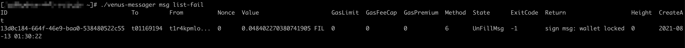

### venus-wallet健康状态检查:

#### 1、启动

可以看到venus-wallet连接到的gateway节点地址信息和venus-gateway建立连接的会话ID信息

```bash
wallet_event/listenevent.go:173	restarting listenWalletRequestOnce	{"api hub": "/dns/gateway.filincubator.com/tcp/83/wss"}
wallet_event/listenevent.go:200	connect to server 9ad36ec8-4a47-4f84-b618-e89cf03f6f38	{"api hub": "/dns/gateway.filincubator.com/tcp/83/wss"
```

但如果有类似如下的报错信息，则为异常启动:

```bash
 ERROR   wallet_event    wallet_event/listenevent.go:236 WalletSign error password not set       {"api hub": "/dns/gateway.filincubator.com/tcp/83/wss"}
```

从日志报venus-wallet的密码没有设置，需要执行**./venus-wallet setpwd**来配置wallet的密码。


#### 2、锁定钱包

如下执行以下命令，则可以上锁钱包，**建议不要尝试**:

```bash
./venus-wallet  lock
Password:******
wallet lock successfully
```

此时，在日志中会有一条如下信息:

```bash
WARN  rpc  go-jsonrpc@v1.1ec/handler.go:279  error in RPC call to 'Filecoin.Unlock': wallet already unlocked
```

现在venus-wallet已经上锁了，这个会影响venus-sealer发送到venus-message的消息不会被签名,如下图:



可以执行如下命令，解锁venus-wallet，可以对venus-sealer发出来的消息进行签名后，由venus节点向链上发送

```bash
./venus-wallet  unlock
Password:******
wallet unlock successfully
```


### Venus-sealer健康状态检查:

主要可以从输出的日志中看到版本信息、节点同步状态、加载证明参数文件、本地存储id和venus-sealer连接到venus-gateway节点的会话建立等信息；


### venus-worker健康状态检查:

```bash
 INFO    main    venus-worker/main.go:158        Starting venus worker
 INFO    main    venus-worker/main.go:188        config: {~/.venusworker/config.toml ~/.venusworker {/ip4/10.108.2.42/tcp/6666 eyJhbGciOiJIUzaW4iXX0.4ZDslo6-8kD74} {sqlite {    0 0 0s} {worker.db}}}
 INFO    main    venus-worker/main.go:255        Remote version 1.0.2+api1.2.0
 WARN    paramfetch      go-paramfetch@v0.0.2-0.20210614165157-25a6c7769498/paramfetch.go:158    Assuming parameter files are ok. DO NOT USE IN PRODUCTION
 WARN    paramfetch      go-paramfetch@v0.0.2-0.20210614165157-25a6c7769498/paramfetch.go:158    Assuming parameter files are ok. DO NOT USE IN PRODUCTION
 INFO    paramfetch      go-paramfetch@v0.0.2-0.20210614165157-25a6c7769498/paramfetch.go:207    parameter and key-fetching complete
 INFO    main    venus-worker/main.go:306        Acceptable task types: [seal/v0/fetch seal/v0/commit/1 seal/v0/finalize seal/v0/commit/2]
 INFO    main    venus-worker/main.go:356        Opening local storage; connecting to master
 INFO    main    venus-worker/main.go:408        Setting up control endpoint at 10.121.2.214:5555
 INFO    main    venus-worker/main.go:507        Making sure no local tasks are running
 INFO    main    venus-worker/main.go:530        Worker registered successfully, waiting for tasks
```

可以从venus-worker日志中，看到venus-worker启动后加载的配置文件目录，监控的端口号；以及在启动之后注册到venus-sealer上，等待获取任务。


如下输出以下信息，则说明venus-worker已经获得了新的任务:

```bash
INFO filcrypto::proofs::api > seal_commit_phase2: start
INFO filecoin_proofs::api::seal > seal_commit_phase2:start: SectorId(1000054)
INFO filecoin_proofs::caches > trying parameters memory cache for: STACKED[34359738368]
INFO filecoin_proofs::caches > no params in memory cache for STACKED[34359738368]
INFO storage_proofs_core::parameter_cache > parameter set identifier for cache: layered_drgporep::PublicParams{ graph: stacked_graph::StackedGraph{expansion_degree: 8 base_graph
```

