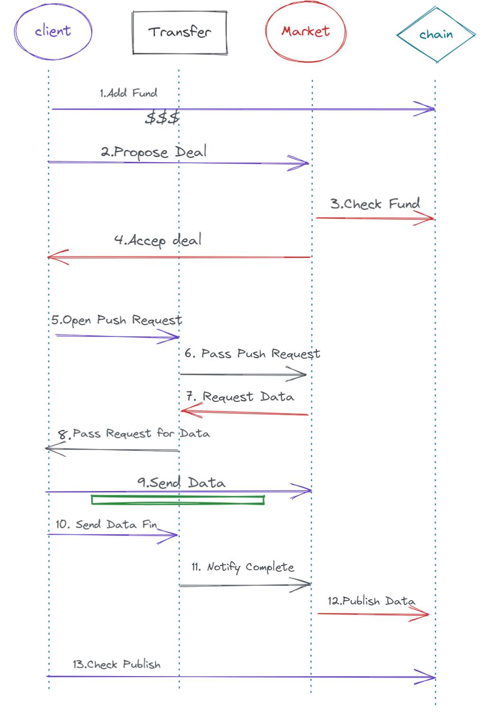
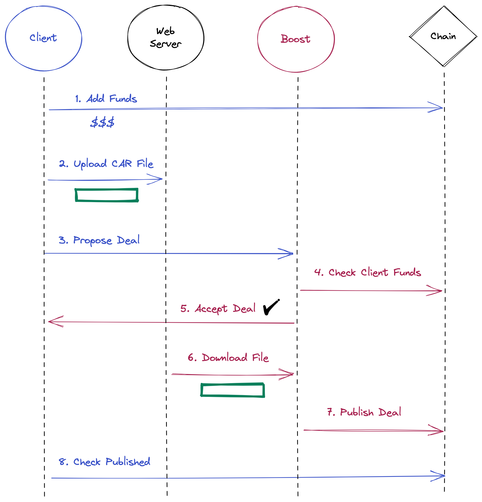
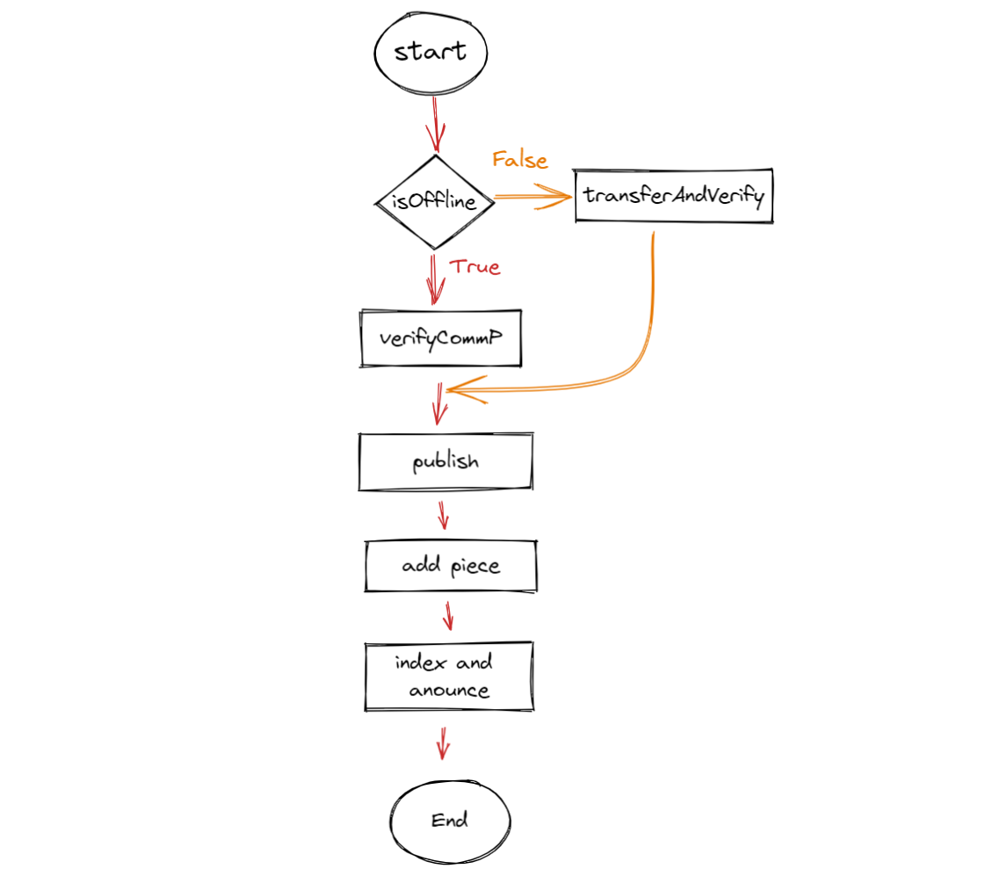
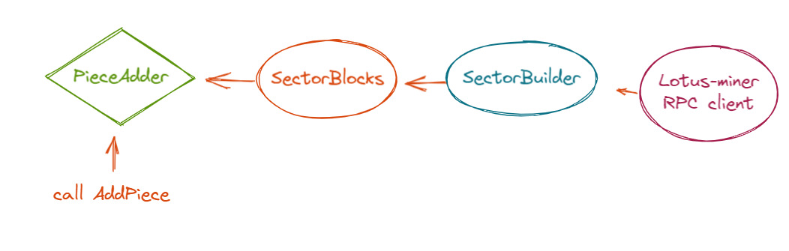

# boost 新增协议兼容性调研

## 结论

1. boost 在协议层补充了两个新的协议 (细节见后文)
   1. `/fil/storage/mk/1.2.0`
   2. `/fil/storage/status/1.2.0`
2. 新协议的提出主要改进了 client 到 market 的数据传输,并不会对 venus-market 多矿工的架构造成影响
3. 现在的 venus-market 可以比较顺滑地升级以支持新的协议

## 协议变化

boost 在兼容以前协议的基础上,新增了两种协议:

- 向 market 推送订单的协议: `/fil/storage/mk/1.2.0`
- 以及查询订单数据: `/fil/storage/status/1.2.0`

### `/fil/storage/mk/1.2.0`

#### Request

##### 描述

| Field              | Type               | Description                                                      |
| ------------------ | ------------------ | ---------------------------------------------------------------- |
| DealUUID           | uuid               | gen by client with uuid ("github.com/google/uuid")               |
| IsOffline          | boolean            | Indicates whether the deal is online or offline                  |
| ClientDealProposal | ClientDealProposal | Same as `<v1 proposal>.DealProposal`                             |
| DealDataRoot       | cid                | The root cid of the CAR file. Same as `<v1 proposal>.Piece.Root` |
| Transfer           | struct             | Transfer has the parameters for a data transfer                  |

```go
type DealParams struct {
	DealUUID           uuid.UUID
	IsOffline          bool
	ClientDealProposal market.ClientDealProposal
	DealDataRoot       cid.Cid
	Transfer           Transfer // Transfer params will be the zero value if this is an offline deal
}


// Transfer has the parameters for a data transfer
type Transfer struct {
	// The type of transfer eg "http"
	Type string
	// An optional ID that can be supplied by the client to identify the deal
	ClientID string
	// A byte array containing marshalled data specific to the transfer type
	// eg a JSON encoded struct { URL: "<url>", Headers: {...} }
	Params []byte
	// The size of the data transferred in bytes
	Size uint64
}
```

目前 boost 中只支持 http 类型的 transfer

#### Response

##### 描述

| Field    | Type    | Description                                        |
| -------- | ------- | -------------------------------------------------- |
| Accepted | boolean | Indicates whether the deal proposal was accepted   |
| Message  | string  | A message about why the deal proposal was rejected |

```go
type DealResponse struct {
	Accepted bool
	// Message is the reason the deal proposal was rejected. It is empty if
	// the deal was accepted.
	Message string
}
```

### `/fil/storage/status/1.2.0`

### Request

##### 描述

| Field     | Type                                                                                                                                      | Description                                        |
| --------- | ----------------------------------------------------------------------------------------------------------------------------------------- | -------------------------------------------------- |
| DealUUID  | uuid                                                                                                                                      | The uuid of the deal                               |
| Signature | [Signature](https://github.com/filecoin-project/go-state-types/blob/057cdfb837f7a0309c1607c7c4640f315e51d7af/crypto/signature.go#L36-L39) | A signature over the uuid with the client's wallet |

```go
// DealStatusRequest is sent to get the current state of a deal from a
// storage provider
type DealStatusRequest struct {
	DealUUID  uuid.UUID
	Signature crypto.Signature
}
```

### Response

##### 相关源码

| Field             | Type    | Description                                                    |
| ----------------- | ------- | -------------------------------------------------------------- |
| DealUUID          | uuid    | The uuid of the deal                                           |
| Error             | string  | Non-empty if there's an error getting the deal status          |
| IsOffline         | boolean | Indicates whether the deal is online or offline                |
| TransferSize      | integer | The total size of the transfer in bytes                        |
| NBytesReceived    | integer | The number of bytes that have been downloaded                  |
| DealStatus        | struct  | the status of deal                                             |
| SignedProposalCid | cid     | cid of the client deal proposal + signature                    |
| PublishCid        | cid     | The cid of the publish message, if the deal has been published |
| ChainDealID       | integer | The ID of the deal on chain, if it's been published            |

```go

// DealStatusResponse is the current state of a deal
type DealStatusResponse struct {
	DealUUID uuid.UUID
	// Error is non-empty if there is an error getting the deal status
	// (eg invalid request signature)
	Error          string
	DealStatus     *DealStatus
	IsOffline      bool
	TransferSize   uint64
	NBytesReceived uint64
}

type DealStatus struct {
	// Error is non-empty if the deal is in the error state
	Error string
	// Status is a string corresponding to a deal checkpoint
	Status string
	// SealingStatus is the sealing status reported by lotus miner
	SealingStatus string
	// Proposal is the deal proposal
	Proposal market.DealProposal
	// SignedProposalCid is the cid of the client deal proposal + signature
	SignedProposalCid cid.Cid
	// PublishCid is the cid of the Publish message sent on chain, if the deal
	// has reached the publish stage
	PublishCid *cid.Cid
	// ChainDealID is the id of the deal in chain state
	ChainDealID abi.DealID
}

// status
const (
	Accepted Checkpoint = iota
	Transferred
	Published
	PublishConfirmed
	AddedPiece
	IndexedAndAnnounced
	Complete
)

var names = map[Checkpoint]string{
	Accepted:            "Accepted",
	Transferred:         "Transferred",
	Published:           "Published",
	PublishConfirmed:    "PublishConfirmed",
	AddedPiece:          "AddedPiece",
	IndexedAndAnnounced: "IndexedAndAnnounced",
	Complete:            "Complete",
}

// SealingStatus string类型,没看到所有的枚举定义

```

## boost 的相关实现

#### 发起存储订单的流程

##### 对比之前的订单发起流程

boost 实现的新的订单发起流程主要是基于 `/fil/storage/mk/1.2.0` 拓展了 client 向 market 传输数据的方式(目前 boost 只实现了 http 的形式),舍弃了原本的`graphsync`,同时也简化了协商的流程

###### 两者的时序图

- 传统的的订单发起流程 (基于 /fil/storage/mk/1.0.1 , /fil/storage/mk/1.1.0 /fil/storage/mk/1.1.1 )



- boost 提出的新的订单发起流程 (基于 /fil/storage/mk/1.2.0 )



##### 相关源码

线上订单时,client 根据 cli-flag 生成 types.Transfer (离线订单时该对象为空)

```go

// Store the path to the CAR file as a transfer parameter
transferParams := &types2.HttpRequest{URL: cctx.String("http-url")}

if cctx.IsSet("http-headers") {
	transferParams.Headers = make(map[string]string)

	for _, header := range cctx.StringSlice("http-headers") {
		sp := strings.Split(header, "=")
		if len(sp) != 2 {
			return fmt.Errorf("malformed http header: %s", header)
		}

		transferParams.Headers[sp[0]] = sp[1]
	}
}

paramsBytes, err := json.Marshal(transferParams)
if err != nil {
	return fmt.Errorf("marshalling request parameters: %w", err)
}
transfer.Type = "http"
transfer.Params = paramsBytes

```

准备发起订单的请求参数

```go
// Create a deal proposal to storage provider using deal protocol v1.2.0 format
dealProposal, err := dealProposal(ctx, n, walletAddr, rootCid, abi.PaddedPieceSize(pieceSize), pieceCid, maddr, startEpoch, cctx.Int("duration"), cctx.Bool("verified"), providerCollateral, abi.NewTokenAmount(cctx.Int64("storage-price")))
if err != nil {
	return fmt.Errorf("failed to create a deal proposal: %w", err)
}

dealParams := types.DealParams{
	DealUUID:           dealUuid,
	ClientDealProposal: *dealProposal,
	DealDataRoot:       rootCid,
	IsOffline:          !isOnline,
	Transfer:           transfer,
}


func dealProposal(ctx context.Context, n *clinode.Node, clientAddr address.Address, rootCid cid.Cid, pieceSize abi.PaddedPieceSize, pieceCid cid.Cid, minerAddr address.Address, startEpoch abi.ChainEpoch, duration int, verified bool, providerCollateral abi.TokenAmount, storagePrice abi.TokenAmount) (*market.ClientDealProposal, error) {
	endEpoch := startEpoch + abi.ChainEpoch(duration)
	// deal proposal expects total storage price for deal per epoch, therefore we
	// multiply pieceSize * storagePrice (which is set per epoch per GiB) and divide by 2^30
	storagePricePerEpochForDeal := big.Div(big.Mul(big.NewInt(int64(pieceSize)), storagePrice), big.NewInt(int64(1<<30)))
	l, err := market.NewLabelFromString(rootCid.String())
	if err != nil {
		return nil, err
	}
	proposal := market.DealProposal{
		PieceCID:             pieceCid,
		PieceSize:            pieceSize,
		VerifiedDeal:         verified,
		Client:               clientAddr,
		Provider:             minerAddr,
		Label:                l,
		StartEpoch:           startEpoch,
		EndEpoch:             endEpoch,
		StoragePricePerEpoch: storagePricePerEpochForDeal,
		ProviderCollateral:   providerCollateral,
	}

	buf, err := cborutil.Dump(&proposal)
	if err != nil {
		return nil, err
	}

	sig, err := n.Wallet.WalletSign(ctx, clientAddr, buf, api.MsgMeta{Type: api.MTDealProposal})
	if err != nil {
		return nil, fmt.Errorf("wallet sign failed: %w", err)
	}

	return &market.ClientDealProposal{
		Proposal:        proposal,
		ClientSignature: *sig,
	}, nil
}
```

client 发送订单请求

```go
s, err := n.Host.NewStream(ctx, addrInfo.ID, DealProtocolv120)
if err := cborutil.WriteCborRPC(s, &dealParams); err != nil {
	errc <- fmt.Errorf("failed to send request: %w", err)
	return
}
```

boost 接收到订单后,会先进行两步处理

1. 校验订单的参数
   - 校验的参数包括: PieceCID,signature,Provider,piece size,duration,epoch,provider collateral,ask,client fun 等等
2. 将订单注入到 boost 的订单处理循环

```go
// ExecuteDeal is called when the Storage Provider receives a deal proposal
// from the network
func (p *Provider) ExecuteDeal(ctx context.Context, dp *types.DealParams, clientPeer peer.ID) (*api.ProviderDealRejectionInfo, error) {
	ctx, span := tracing.Tracer.Start(ctx, "Provider.ExecuteDeal")
	defer span.End()

	span.SetAttributes(attribute.String("dealUuid", dp.DealUUID.String())) // Example of adding additional attributes

	p.dealLogger.Infow(dp.DealUUID, "executing deal proposal received from network", "peer", clientPeer)

	ds := types.ProviderDealState{
		DealUuid:           dp.DealUUID,
		ClientDealProposal: dp.ClientDealProposal,
		ClientPeerID:       clientPeer,
		DealDataRoot:       dp.DealDataRoot,
		Transfer:           dp.Transfer,
		IsOffline:          dp.IsOffline,
		Retry:              smtypes.DealRetryAuto,
	}
	// validate the deal proposal (校验订单数据)
	if err := p.validateDealProposal(ds); err != nil {
		reason := err.reason
		if reason == "" {
			reason = err.Error()
		}
		p.dealLogger.Infow(dp.DealUUID, "deal proposal failed validation", "err", err.Error(), "reason", reason)

		return &api.ProviderDealRejectionInfo{
			Reason: fmt.Sprintf("failed validation: %s", reason),
		}, nil
	}

	// 将订单注入 订单处理循环
	return p.executeDeal(ctx, ds)
}
```

#### 订单的处理

##### 订单处理循环

本小结简要介绍 boost 中订单处理循环 的处理流程
该订单处理循环是个典型的 select-case 结构
每个 case 对应一个 channel 作为循环的入口

```go
	// channels used to pass messages to run loop


	// 接入达成 dealcheckpoints.AddedPiece 状态之前的订单
	// 会处理订单直到订单达成 dealcheckpoints.AddedPiece
	acceptDealChan       chan acceptDealReq

	// 接入达成 dealcheckpoints.Published 的订单的
	// 释放占用的 fund 资源
	publishedDealChan    chan publishDealReq

	// 接入 addpiece 之后的订单
	// 释放被占用的 storage space 资源
	storageSpaceChan     chan storageSpaceDealReq

	// 接入需要清理资源占用的的订单 (完成的订单,或者失败的订单)
	// 清理订单的资源占用,主要是 fund 和 storage space
	finishedDealChan     chan finishedDealReq

	// 接入希望重启或者希望终止 的已经停止的订单
	// 重启或者终止一个停止了的订单
	updateRetryStateChan chan updateRetryStateReq
```

注释:

- fund 资源:
  boost 用于抵押的资金,在 deal 初始化时被分配, deal 发布之后,被分配的资金会作为抵押被转走,同时也应该释放相应 deal 的资金占用
- storage 资源:
  boost 用于存储订单数据的存储空间资源,在订单创建时会被分配,在订单被 addpiece 之后会被释放掉

##### acceptDealChan 分支

五个 case 之中,会着重介绍 acceptDealChan 所在的 case 分支

```go
// case  <-p.acceptDealChan 的部分源码

select {
	// Process a request to
	// - accept a deal proposal and execute it immediately
	// - accept an offline deal proposal and save it for execution later
	//   when the data is imported
	// - accept a request to import data for an offline deal
	case dealReq := <-p.acceptDealChan:
		deal := dealReq.deal
		p.dealLogger.Infow(deal.DealUuid, "processing deal acceptance request")

		// 离线订单,预处理,等待数据导入
		if deal.IsOffline && !dealReq.isImport {
			// When the client proposes an offline deal, save the deal
			// to the database but don't execute the deal. The deal
			// will be executed when the Storage Provider imports the
			// deal data.
			dh, err := p.mkAndInsertDealHandler(deal.DealUuid)

			// 1.检查订单不重复
			// 2.初始化订单,将之保存到数据库
			aerr := p.processOfflineDealProposal(dealReq.deal, dh)

			// The deal proposal was successful. Send an Accept response to the client.
			dealReq.rsp <- acceptDealResp{ri: &api.ProviderDealRejectionInfo{Accepted: true}}
			// Don't execute the deal now, wait for data import.
			continue
		}


		// 1. 分配 fund 和 storage space 资源
		// 2. 初始化订单参数,包括订单数据的路径,创建订单的时间记录等
		if deal.IsOffline {
			// 离线订单,并且订单数据已经导入
			// The Storage Provider is importing offline deal data, so tag
			// funds for the deal and execute it
			aerr = p.processImportOfflineDealData(dealReq.deal)
		} else {
			// 在线订单
			// Process a regular deal proposal
			aerr = p.processDealProposal(dealReq.deal)
		}
		if aerr != nil {
			sendErrorResp(aerr)
			continue
		}

		// set up deal handler so that clients can subscribe to deal update events
		dh, err := p.mkAndInsertDealHandler(deal.DealUuid)
		if err != nil {
			sendErrorResp(&acceptError{error: err, isSevereError: true, reason: "server error: starting deal thread"})
			continue
		}

		// start executing the deal
		_, err = p.startDealThread(dh, deal)
		if err != nil {
			sendErrorResp(&acceptError{error: err, isSevereError: true, reason: "server error: starting deal thread"})
			continue
		}

		// send an accept response
		dealReq.rsp <- acceptDealResp{&api.ProviderDealRejectionInfo{Accepted: true}, nil}

	case ....
}
```

在线订单会在完成订单资源分配和参数初始化之后,就会真正地开始执行订单处理线程
离线订单会两次进入这一段代码,第一次初始化订单参数之后退出,当导入离线数据的时候会再次进入这段代码,进行资源分配并开始 叮当处理线程

##### 订单处理线程

简要流程



相关源码

```go

func (p *Provider) execDealUptoAddPiece(ctx context.Context, deal *types.ProviderDealState, dh *dealHandler) *dealMakingError {
	pub := dh.Publisher
	// publish "new deal" event
	p.fireEventDealNew(deal)
	// publish an event with the current state of the deal
	p.fireEventDealUpdate(pub, deal)

	p.dealLogger.Infow(deal.DealUuid, "deal execution in progress")

	// Transfer Data step will be executed only if it's NOT an offline deal
	if !deal.IsOffline {
		if deal.Checkpoint < dealcheckpoints.Transferred {
			// Check that the deal's start epoch hasn't already elapsed
			if derr := p.checkDealProposalStartEpoch(deal); derr != nil {
				return derr
			}
			// download data from the client,and verifyCommP
			if err := p.transferAndVerify(dh, pub, deal); err != nil {
				// The transfer has failed. If the user tries to cancel the
				// transfer after this point it's a no-op.
				dh.setCancelTransferResponse(nil)

				return err
			}

			p.dealLogger.Infow(deal.DealUuid, "deal data transfer finished successfully")
		} else {
			p.dealLogger.Infow(deal.DealUuid, "deal data transfer has already been completed")
		}
		// transfer can no longer be cancelled
		dh.setCancelTransferResponse(errors.New("transfer already complete"))
		p.dealLogger.Infow(deal.DealUuid, "deal data-transfer can no longer be cancelled")
	} else if deal.Checkpoint < dealcheckpoints.Transferred {
		// verify CommP matches for an offline deal
		if err := p.verifyCommP(deal); err != nil {
			err.error = fmt.Errorf("error when matching commP for imported data for offline deal: %w", err)
			return err
		}
		p.dealLogger.Infow(deal.DealUuid, "commp matched successfully for imported data for offline deal")

		// update checkpoint
		if derr := p.updateCheckpoint(pub, deal, dealcheckpoints.Transferred); derr != nil {
			return derr
		}
	}

	// Publish
	if deal.Checkpoint <= dealcheckpoints.Published {
		if err := p.publishDeal(ctx, pub, deal); err != nil {
			return err
		}
		p.dealLogger.Infow(deal.DealUuid, "deal successfully published and confirmed-publish")
	} else {
		p.dealLogger.Infow(deal.DealUuid, "deal has already been published and confirmed-publish")
	}

	// Now that the deal has been published, we no longer need to have funds
	// tagged as being for this deal (the publish message moves collateral
	// from the storage market actor escrow balance to the locked balance)
	if err := p.untagFundsAfterPublish(ctx, deal); err != nil {
		// If there's an error untagging funds we should still try to continue,
		// so just log the error
		p.dealLogger.Warnw(deal.DealUuid, "failed to untag funds after sending publish message", "err", err)
	} else {
		p.dealLogger.Infow(deal.DealUuid, "funds successfully untagged for deal after publish")
	}

	// AddPiece
	if deal.Checkpoint < dealcheckpoints.AddedPiece {
		if err := p.addPiece(ctx, pub, deal); err != nil {
			err.error = fmt.Errorf("failed to add piece: %w", err.error)
			return err
		}
		p.dealLogger.Infow(deal.DealUuid, "deal successfully handed over to the sealing subsystem")
	} else {
		p.dealLogger.Infow(deal.DealUuid, "deal has already been handed over to the sealing subsystem")
	}

	// as deal has already been handed to the sealer, we can remove the inbound file and reclaim the tagged space
	if !deal.IsOffline {
		_ = os.Remove(deal.InboundFilePath)
		p.dealLogger.Infow(deal.DealUuid, "removed inbound file as deal handed to sealer", "path", deal.InboundFilePath)
	}
	if err := p.untagStorageSpaceAfterSealing(ctx, deal); err != nil {
		// If there's an error untagging storage space we should still try to continue,
		// so just log the error
		p.dealLogger.Warnw(deal.DealUuid, "failed to untag storage space after handing deal to sealer", "err", err)
	} else {
		p.dealLogger.Infow(deal.DealUuid, "storage space successfully untagged for deal after it was handed to sealer")
	}

	// Index deal in DAGStore and Announce deal
	if deal.Checkpoint < dealcheckpoints.IndexedAndAnnounced {
		if err := p.indexAndAnnounce(ctx, pub, deal); err != nil {
			err.error = fmt.Errorf("failed to add index and announce deal: %w", err.error)
			return err
		}
		p.dealLogger.Infow(deal.DealUuid, "deal successfully indexed and announced")
	} else {
		p.dealLogger.Infow(deal.DealUuid, "deal has already been indexed and announced")
	}

	return nil
}
```

#### 订单分配

在订单的处理流程中, addpiece 阶段会将订单数据分配到矿工的扇区.
这个过程主要是通过调用 PieceAdder 接口的 AddPiece 方法来实现.
其中 PieceAdder 主要底层是由 lotus-miner 的 rpc client 来实现的,其依赖路径如下

